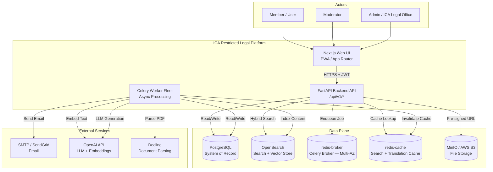
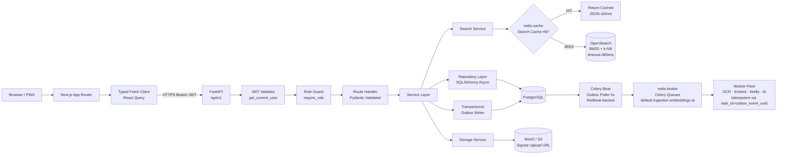
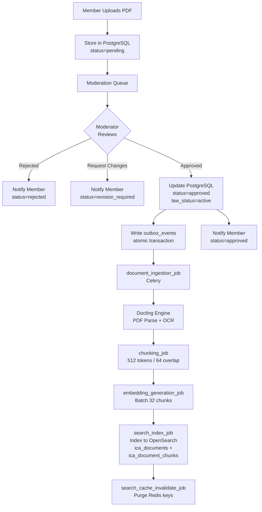
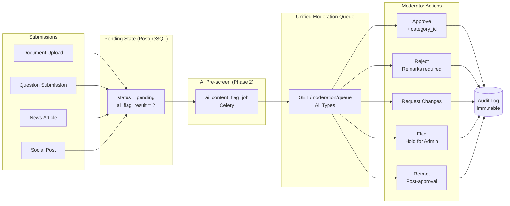
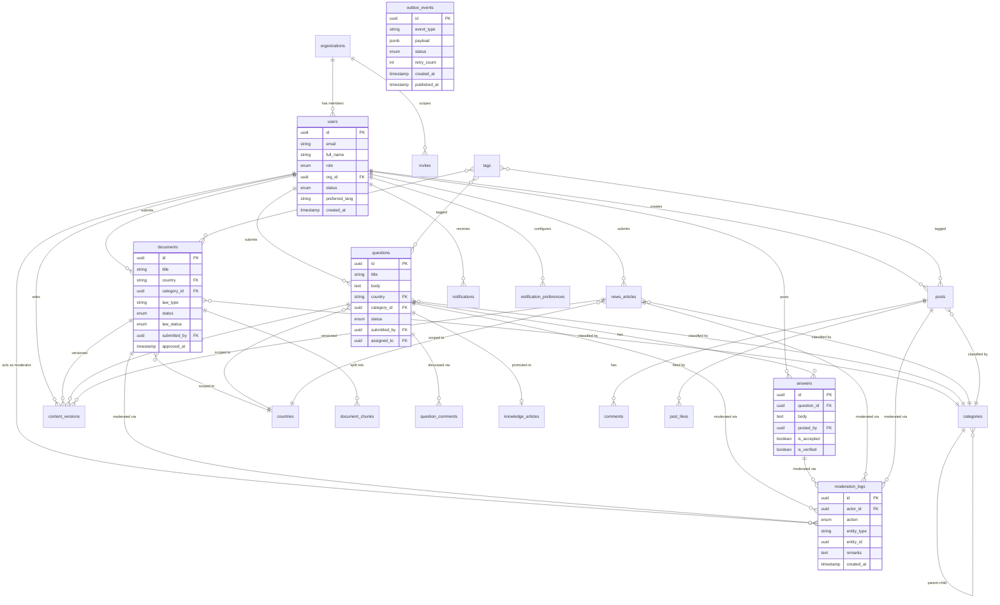
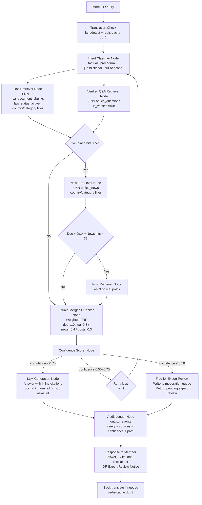
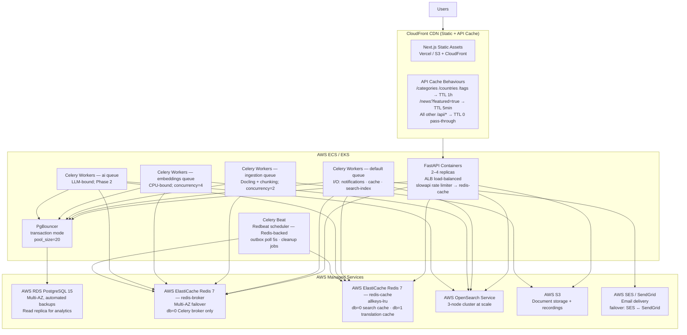
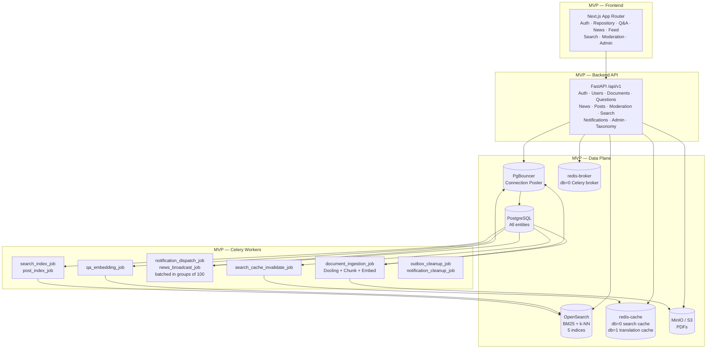

# ICA Restricted Legal Platform — Solution Architecture Document

**Document Version:** 1.0  
**Date:** 2026-05-13  
**Status:** Draft  
**Prepared for:** ICA (International Cooperative Alliance)  
**Document Type:** Solution Architecture Document (SAD)  
**Prepared by:** Solution Architecture Team  

---

## Table of Contents

1. [Architecture Overview](#1-architecture-overview)
2. [Proposed Technology Stack](#2-proposed-technology-stack)
3. [High-Level Architecture](#3-high-level-architecture)
4. [Architecture Diagram](#4-architecture-diagram)
5. [Module-wise Architecture](#5-module-wise-architecture)
6. [Data Architecture](#6-data-architecture)
7. [Security Architecture](#7-security-architecture)
8. [Search Architecture](#8-search-architecture)
9. [AI / RAG Architecture](#9-ai--rag-architecture)
10. [Deployment Architecture](#10-deployment-architecture)
11. [API Architecture](#11-api-architecture)
12. [Non-Functional Architecture](#12-non-functional-architecture)
13. [MVP Architecture](#13-mvp-architecture)
14. [Future Architecture Enhancements](#14-future-architecture-enhancements)

---

## 1. Architecture Overview

### 1.1 Business Context

The International Cooperative Alliance (ICA) operates a global network of cooperative organisations across diverse legal jurisdictions. Legal knowledge today is fragmented — distributed across email threads, national repositories, and informal professional networks. The ICA Restricted Legal Platform is an invite-only, governed knowledge collaboration platform that consolidates cooperative law knowledge, provides expert-moderated Q&A, curates legal news, and supports a professional social community — all within a single secure and auditable environment.

The platform serves three primary actor groups:

| Actor | Role |
|---|---|
| ICA Legal Office Staff | Platform administrators, legal experts, and official content authors |
| Legal Professionals / Moderators | Subject-matter experts who review, validate, and approve all user-generated content |
| ICA Member Organisations | Staff members of ICA-affiliated cooperatives who consume, contribute, and collaborate |

### 1.2 Architecture Goals

| # | Goal |
|---|---|
| AG-1 | Deliver a governed, moderation-first platform where no unvetted content ever reaches members |
| AG-2 | Provide hybrid keyword + semantic search across all content types without overloading PostgreSQL |
| AG-3 | Support AI-assisted discovery and Q&A generation (assistive only — never authoritative) |
| AG-4 | Maintain a complete, tamper-proof audit trail for all content decisions and AI actions |
| AG-5 | Support multilingual access for a global membership without duplicating content management effort |
| AG-6 | Design for progressive enhancement: MVP without AI layer, AI enabled in Phase 2 without re-architecture |
| AG-7 | Enforce data privacy and GDPR compliance by design (anonymisation path, PII isolation, TTL cleanup) |
| AG-8 | Keep infrastructure complexity proportional to scale — start simple, scale incrementally |

### 1.3 Key Architectural Principles

| Principle | Statement |
|---|---|
| **Moderation-first** | All user-generated content (UGC) enters `pending` state. No content bypasses the moderation queue except Admin-originated official posts. |
| **CQRS-lite** | Writes and state mutations go to PostgreSQL (system of record). Member-facing search and discovery go through OpenSearch exclusively. No member-facing full-text search on PostgreSQL. |
| **AI is assistive** | AI answers, suggestions, and summaries are labelled as assistive. They require human review before being marked authoritative. The platform never surfaces AI output as legal advice. |
| **Async-first for heavy work** | OCR, embedding, translation, notification dispatch, and AI processing are always executed via Celery workers. API endpoints never block on these operations. |
| **Transactional outbox** | Domain events (approval, rejection, indexing triggers) are written atomically with the state change in the same PostgreSQL transaction. Celery polls the outbox; the source of truth is the database. |
| **Layered architecture** | Backend is structured API → Service → Repository with no business logic in route handlers. Frontend uses React Query for server state and Zustand for local UI state. |
| **Storage separation** | Binary files go to MinIO/S3. Metadata goes to PostgreSQL. Indexed/searchable content goes to OpenSearch. Translation and search caches go to `redis-cache`. The Celery broker runs on a separate `redis-broker` instance — broker and cache are never co-hosted. These concerns are never mixed. |
| **Privacy by design** | PII fields live only in `users` table. User deletion anonymises rather than hard-deletes. AI audit logs have a 30-day TTL. |

### 1.4 High-Level System Overview

The platform is a **modular monolith** structured around a REST API backend, a React single-page application, an async worker fleet, and a three-tier data plane (PostgreSQL + OpenSearch + Redis). The design is service-ready: modules are cleanly separated at the service layer and can be extracted to independent services when scale justifies it.

```
┌─────────────────────────────────────────────────────────────────────┐
│                         Member Browser / Admin                        │
│                         Next.js PWA (App Router)                      │
└─────────────────────────────┬───────────────────────────────────────┘
                               │  HTTPS + JWT  (via CloudFront → ALB)
┌─────────────────────────────▼───────────────────────────────────────┐
│                        FastAPI Backend API                            │
│  Auth · Users · Documents · Q&A · News · Posts · Moderation          │
│  Search · Notifications · Admin · Taxonomy · AI                       │
└──┬──────────┬──────────────┬──────────┬────────────┬────────────────┘
   │          │              │          │            │
┌──▼──┐ ┌────▼────┐  ┌──────▼───┐ ┌───▼──────┐ ┌──▼───────────┐
│ PgB │ │OpenSearch│  │redis-    │ │redis-    │ │ MinIO / S3   │
│ounce│ │Search+k-N│  │broker    │ │cache     │ │(File Storage)│
│ r   │ │N         │  │(Celery Q)│ │(Search + │ │              │
└──┬──┘ └──────────┘  └──────────┘ │ Trans Q) │ └──────────────┘
   │                                └──────────┘
┌──▼──────────┐
│ PostgreSQL  │
│ (Primary DB)│
└─────────────┘
        │
┌───────▼────────────────────────────────────────────────┐
│                   Celery Worker Fleet                    │
│  default: Notify · Cache · Post-index · Search-index    │
│  ingestion: Docling · Chunk                              │
│  embeddings: Embed                                       │
│  ai: RAG · Flag · Summarise  (Phase 2)                  │
└────────────────────────────────────────────────────────┘
```

---

## 2. Proposed Technology Stack

| Layer | Technology | Purpose | Reason for Selection |
|---|---|---|---|
| **Frontend Framework** | Next.js 16 (App Router) + TypeScript | Server-side rendering, routing, and PWA capabilities | App Router enables fine-grained layout nesting, RSC, and streaming; TypeScript enforces type safety across frontend/backend contract |
| **UI Component Library** | MUI (Material UI) v5 | Component system, theming, accessibility | Enterprise-grade accessible components; ICA brand theming via MUI theme object |
| **CSS Utility Layer** | Tailwind CSS | Rapid layout and spacing utilities alongside MUI | Complements MUI for custom layouts without overriding component styles |
| **Frontend State — Server** | React Query (TanStack Query v5) | Remote data fetching, caching, and mutation | Automatic cache invalidation, optimistic updates, and loading/error states without boilerplate |
| **Frontend State — Client** | Zustand | Auth token, role switcher, UI state | Minimal API; no context wrapper boilerplate; persists auth to localStorage |
| **Frontend Mocking** | MSW (Mock Service Worker) | UI development and demo mode without running backend | Intercepts fetch at the service worker level; `NEXT_PUBLIC_DEMO_MODE=true` flag activates |
| **Backend Framework** | FastAPI (Python 3.12+) | REST API, dependency injection, OpenAPI | Async-native, auto-generated OpenAPI docs, Pydantic integration, fastest Python framework for I/O workloads |
| **ORM** | SQLAlchemy 2.0 (async) + Alembic | Database access layer and migrations | Full async support in v2; Alembic provides reproducible, versioned migrations |
| **Data Validation** | Pydantic v2 | Request/response schemas, settings management | Deep FastAPI integration; `pydantic-settings` for `.env`-based configuration |
| **Async Task Queue** | Celery 5 + Redis (db=0) | Background job processing | Mature Python task queue; Redis broker is already in stack; horizontal scaling via worker replicas |
| **Primary Database** | PostgreSQL 15+ | System of record for all entities | ACID transactions, JSONB for flexible metadata, row-level security available, proven at scale |
| **Search Engine** | OpenSearch 2.x | Hybrid BM25 full-text + k-NN vector search | Unified keyword and semantic search in one cluster; k-NN plugin replaces need for a separate vector DB; OSS and AWS-managed |
| **Queue Broker** | Redis 7+ — `redis-broker` instance | Celery job broker only | Dedicated instance with Multi-AZ failover; isolates broker availability from cache concerns; db=0 only |
| **Cache** | Redis 7+ — `redis-cache` instance | Search cache + translation cache | db=0 search cache (`search:{sha256}`, TTL 300s) · db=1 translation cache (`trans:{lang}:{sha256}`, TTL 7d); `allkeys-lru` eviction; cache loss is self-healing |
| **Rate Limiter** | slowapi + `redis-cache` | Shared distributed rate limiting across API replicas | Redis-backed counter shared across all FastAPI replicas; prevents per-replica limit bypass |
| **File Storage** | MinIO (dev) → AWS S3 (prod) | Binary file storage for PDFs and attachments | S3-compatible interface; seamless abstraction switch via `STORAGE_PROVIDER` env var |
| **Authentication** | Custom OAuth2 / JWT (FastAPI security layer) | Stateless auth with access + refresh tokens | RS256-signed JWTs; 30-min access / 7-day refresh; RBAC enforced at API layer |
| **Email** | SMTP / SendGrid | Password reset, invite notifications, account events | SendGrid for production deliverability; SMTP for local development |
| **Embedding — Local** | sentence-transformers `all-MiniLM-L6-v2` | Dense vector embeddings (384 dims) for semantic search | Runs on CPU in Docker Compose; 80ms/chunk; no external API cost during development |
| **Embedding — Cloud** | OpenAI `text-embedding-3-small` | Production embedding quality | Higher accuracy; cost-controlled via batch processing; switchable via `EMBEDDING_PROVIDER` env var |
| **LLM (RAG)** | OpenAI GPT-4o-mini (or equivalent) | Answer generation in RAG pipeline | Configurable; assistive label enforced at application layer |
| **RAG Orchestration** | LangGraph (within Celery `ai_answer_job`) | Multi-node RAG workflow with confidence scoring and audit trail | Graph-based state machine; handles intent classification, multi-source retrieval, RRF merging, confidence routing, and audit logging without custom orchestration code |
| **Document Parsing** | Docling (`python-docling`) | PDF text extraction, OCR for scanned pages, table structure recognition | IBM open-source; replaces fragile custom OCR stack; structured JSON output preserving paragraph boundaries; timeout-safe |
| **Container Runtime** | Docker + Docker Compose | Local development and deployment | Reproducible environment; all services (API, workers, DB, search, Redis, MinIO) orchestrated in single Compose file |
| **Live Sessions (Phase 3)** | LiveKit | Real-time audio/video expert Q&A rooms | WebRTC-native; server-side room and token management; S3 recordings; webhook integration |
| **Language Detection** | `langdetect` (Python) | Detect query language before translation | < 5ms; no external API; determines whether translation pipeline is needed |

---

## 3. High-Level Architecture

The platform is composed of the following major architectural components:

### 3.1 Web UI (Next.js PWA)

The frontend is a Next.js 16 application using the App Router. It is a Progressive Web Application (PWA) that runs in the browser and communicates exclusively with the FastAPI backend via a typed fetch client. It renders server components for initial page load and delegates data fetching to React Query on the client. The UI is structured around three role contexts: Member, Moderator, and Admin — each with a distinct navigation and feature set.

Key technical characteristics:
- Route groups: `(auth)` for unauthenticated flows; `(app)` for all protected pages
- MSW mock layer activated by `NEXT_PUBLIC_DEMO_MODE=true` for UI development
- Zustand store holds auth token and current role; React Query owns all server state
- MUI ThemeProvider wraps the application with ICA brand colours

### 3.2 API Gateway / Backend API (FastAPI)

The FastAPI application is the sole entry point for all client requests. It enforces HTTPS, validates JWT tokens, applies RBAC on every protected route, and delegates to the service layer. It does not contain business logic — it is responsible for request validation (Pydantic), auth/authz (FastAPI dependency injection), and response serialisation.

Key responsibilities:
- JWT validation and role extraction on every protected request via `get_current_user` dependency
- Pydantic request schema validation (rejects malformed input before it reaches services)
- OpenAPI docs generation (auto-served at `/docs`)
- No direct database access — all reads and writes go through the repository layer via the service layer

### 3.3 Authentication and Authorisation Service

Handles the full identity and access lifecycle:
- Invite validation → signup → login → JWT issuance → token refresh → logout → password reset
- Profile management (`PATCH /auth/me`)
- First-login preference capture

JWT tokens use RS256 signing with a configurable key rotation schedule. Access tokens expire in 30 minutes; refresh tokens in 7 days. RBAC is enforced at the API layer — roles cannot be escalated via API manipulation.

### 3.4 User and Role Management Service

Admin-facing service for the user lifecycle:
- Create, update, deactivate users
- Assign and change roles (Member → Moderator)
- View contribution history per user
- Anonymise deleted users (GDPR right-to-erasure via `DELETE /users/{id}`)
- Manage organisations and their `max_users` quota

### 3.5 Legal Content Management Service (Documents)

Handles the full lifecycle of legal documents:
- Upload (PDF or external URL) with mandatory metadata (country, law type, language)
- Moderation queue entry on upload
- Version tracking (append-only `content_versions` row on every edit)
- Post-approval ingestion pipeline: Docling extraction → chunking → embedding → OpenSearch indexing
- Law status lifecycle: `active` → `retracted` / `superseded`
- Download with pre-signed S3/MinIO URL generation

### 3.6 Legal Document Repository Service

Serves the searchable, approved document corpus to members:
- Browse and filter approved documents (country, category, law type, date range, law status)
- Download approved PDFs via pre-signed storage URLs
- Expose version history to Admins and Moderators
- Surface `law_status` prominently in listings; retracted/superseded excluded by default

### 3.7 News Aggregation and Publishing Service

Manages curated legal news and official updates:
- Member submission → pending moderation
- Admin direct publish (bypasses moderation queue)
- Post-approval fan-out broadcast notification to subscribed members
- Admin pin/feature capability for prominent placement
- Category and country targeting for news broadcasts

### 3.8 Moderated Q&A Service

Core community knowledge-building feature:
- Member question submission → pending moderation
- Moderator approval, rejection, revision request, or expert assignment
- Expert and member answer posting
- Accepted answer marking
- Moderator/Admin promotion of approved Q&A to knowledge article
- Automatic embedding and indexing of accepted Q&A pairs into OpenSearch (feeds the RAG corpus)
- `is_verified` flag for lawyer-validated answers (elevated RAG weight)

### 3.9 Search Service

Unified search across all content types:
- Hybrid BM25 + k-NN query execution against OpenSearch
- Pre-filtering by country, category, law status
- Non-English query translation via Redis cache → `translation_job`
- Redis search result caching (5-min TTL; cache invalidated on content approval/retraction)
- Response includes cache hit indicator, query language, search mode, and latency

### 3.10 AI / RAG Service

Assistive AI layer (Phase 2):
- `/ai/ask` — LangGraph-orchestrated RAG pipeline with intent classification, multi-source retrieval, RRF merging, confidence scoring, LLM generation, and audit logging
- `/ai/suggestions/{question_id}` — AI answer suggestions for moderators
- `/ai/summarize/{document_id}` — on-demand document summarisation
- `/ai/summarize/question/{question_id}` — Q&A thread summarisation
- `/{type}/{id}/related` — k-NN related content per item

All AI responses carry an explicit disclaimer that output does not constitute legal advice.

### 3.11 Notification Service

Async notification dispatch via Celery:
- In-app notifications for: approval, rejection, question answered, answer accepted, content flagged, news broadcast
- Member preference management (country/category subscription filters)
- Email notifications for critical events: invite, password reset, account deactivation
- Notification list, unread count, mark read, delete endpoints

### 3.12 Reporting and Analytics Service

Admin-facing platform intelligence:
- User counts by role and organisation
- Content volume by type and status
- Moderation throughput
- AI query volume and estimated cost
- Country-wise content distribution
- Q&A status distribution and unanswered question tracking

### 3.13 Audit Logging Service

Immutable record of all content decisions:
- Every moderation action (Approve, Reject, Request Changes, Flag, Retract) is written to the audit log atomically with the state change
- Audit log is append-only; no UPDATE/DELETE permissions at database level
- AI query audit trail: query, source IDs, confidence score, reasoning path — 30-day TTL
- Invite lifecycle tracking (issued, redeemed, revoked, expired)
- Content version history (every edit creates a version row, never deleted)

### 3.14 Admin Console

Dedicated admin surface:
- User management, role assignment, user deactivation
- Organisation management, invite generation and revocation
- Taxonomy management: categories, tags, supported countries
- Platform configuration: AI confidence thresholds, invite expiry, moderation SLA targets, supported languages
- Analytics dashboard
- Full moderation audit log access

### 3.15 Database (PostgreSQL)

System of record for all entities. Writes from the API layer land here first. OpenSearch and Redis are derived views — they are always reconstitutable from PostgreSQL state. Uses Alembic for versioned schema migrations. Append-only tables for audit trail and content versions enforce tamper-proof history.

### 3.16 File Storage (MinIO / AWS S3)

Binary object storage for uploaded PDFs and attachments. Abstracted behind a `StorageService` with a configurable provider (MinIO for dev, S3 for prod). Files are never served directly through the API — pre-signed URLs are generated with a configurable expiry. Document content bodies are never treated as PII.

**Direct upload (signed PUT URL):** The API does **not** receive file bytes through the FastAPI container. Instead, `POST /documents` returns a pre-signed S3 PUT URL (`StorageService.generate_upload_url()`); the client uploads the PDF directly to S3. The API container receives only the metadata (title, country, category) and the resulting `file_key` (confirmed by the client after upload). This eliminates the 50 MB × N-concurrent-uploads memory burden from API containers entirely.

**S3 Lifecycle rules:**
| Rule | Trigger | Action |
|---|---|---|
| Retracted document files | `law_status=retracted` set in PostgreSQL → `document_retraction_cleanup_job` adds S3 object tag `lifecycle=retracted` | S3 lifecycle rule transitions to Glacier after 90 days; permanent delete after 7 years (legal retention period) |
| Rejected document uploads | `status=rejected` and no re-submission after 30 days → cleanup job removes `file_key` from S3 | Immediate deletion — rejected content has no retention obligation |
| Orphaned uploads | Files in `uploads/` prefix with no matching `documents` row after 48 hours | S3 lifecycle rule deletes — handles aborted uploads and client-side errors |

### 3.17 AI / RAG Layer (Phase 2)

The RAG layer operates entirely within the async worker fleet — it is not a synchronous API dependency. It uses OpenSearch as both the retrieval corpus (BM25 text fields for keyword and k-NN vector fields for semantic) and the index for embedded Q&A pairs. The LLM call is the only external synchronous dependency and is bounded by the 2,500 ms SLA.

---

## 4. Architecture Diagram

### 4.1 System Context Diagram



### 4.2 Request Flow Diagram



### 4.3 Document Ingestion Pipeline



### 4.4 Moderation Queue Architecture



---

## 5. Module-wise Architecture

### 5.1 User Management Module

**Responsibility:** Full lifecycle management of users, organisations, and roles.

**Architecture pattern:** Admin-only write paths via `UserService` → `UserRepository` → PostgreSQL. PII fields (email, full name) isolated in `users` table. Soft-delete via anonymisation.

**Key flows:**
- Admin creates org → generates invite codes → shares out-of-band
- Invite validated at registration → user created with `role=Member`, `org_id` from invite
- First-login redirects to `/auth/setup` for country/category preference capture
- Admin role change: `PATCH /users/{id}/role` → updates `users.role` → outbox event triggers notification

**Boundary rules:**
- No business logic in route handler; service validates org `max_users` before creating invite
- `DELETE /users/{id}` calls `UserService.anonymise()` — never hard-deletes

### 5.2 Role and Access Control Module

**Responsibility:** Enforce RBAC on every API request; manage permission matrix.

**Architecture pattern:** FastAPI dependency injection (`get_current_user` + `require_role`) applied at the route level. Roles are: Admin (A), Moderator (M), Member (U), System (SYS).

**Key mechanisms:**
- JWT contains `user_id`, `role`, `org_id` in payload
- `require_role(["A", "M"])` dependency raises 403 if role not in allowed list
- Invite codes scope users to an org at registration; org cannot be changed post-signup
- Admin role is the only actor that can change roles, deactivate users, or access flagged queue

**Permission matrix (condensed):**

| Operation | A | M | U |
|---|:---:|:---:|:---:|
| Generate invites | ✓ | — | — |
| Manage users/orgs | ✓ | — | — |
| Access moderation queue | ✓ | ✓ | — |
| Approve / Reject / Retract | ✓ | ✓ | — |
| Access flagged queue | ✓ | — | — |
| Submit content | ✓ | ✓ | ✓ |
| View approved content | ✓ | ✓ | ✓ |
| Verify answer (`PATCH /answers/{id}/verify`, sets `is_verified=true`) | ✓ | ✓ | — |
| Use AI search | ✓ | ✓ | ✓ |
| Export own data (`GET /users/me/export`, GDPR) | ✓ | ✓ | ✓ |
| View full audit log | ✓ | — | — |

### 5.3 Legal Content Repository Module

**Responsibility:** Manage the lifecycle of legal documents from submission through moderation, ingestion, and retrieval.

**Architecture pattern:** Three-phase lifecycle managed by `DocumentService`:
1. **Submission phase** — PDF stored in MinIO/S3 (if `source_type=uploaded`); metadata + `status=pending` written to PostgreSQL; outbox event triggers AI pre-screen
2. **Moderation phase** — Moderator reviews via unified queue; actions write to audit log; approval triggers ingestion pipeline
3. **Ingestion phase** — Docling parsing → chunking → embedding → OpenSearch indexing (all async via Celery)

**Source type:**
Documents have a `source_type` field (`uploaded` | `external_url`). When `source_type=external_url`, the ingestion pipeline is not triggered — the document is stored as metadata-only, is not chunked or embedded, and does not appear in search results. The external URL is surfaced as a direct link on the document detail page. Web scraping is not performed.

**Law status lifecycle:**
```
active ──(retract)──▶ retracted
active ──(supersede)─▶ superseded
```
Both transitions exclude the document from default search (`status=active` filter).

**Docling failure path:**
If Docling fails to extract text from an approved document (encrypted, corrupted, or OCR timeout beyond 120 s), the document is automatically rejected:
```
document_ingestion_job (Celery)
  ├── Success → chunking_job → embedding_generation_job → search_index_job
  └── Failure (timeout / encrypted / corrupted)
        → status = 'rejected' in PostgreSQL
        → moderation_logs (actor = system user, action = 'reject',
                           remarks = 'Automatic rejection: Docling extraction failed')
        → notify submitter + approving moderator + all Admins
        → no OpenSearch entry created
```
A dedicated `system` user (role=`admin`) is seeded at migration time and acts as the actor for all automated moderation decisions.

**Version control:**
Every metadata edit (pre- or post-approval) creates a row in `content_versions` (append-only, no delete). `GET /documents/{id}/versions` and `GET /documents/{id}/versions/{vid}` expose the full history to Admins and Moderators.

### 5.4 Country-wise Legal Database Module

**Responsibility:** Provide country-scoped access to the legal repository.

**Architecture pattern:** Country is a first-class filter at both the PostgreSQL and OpenSearch layers. The `countries` table holds supported ISO 3166-1 codes managed by Admin. All document, question, and news submissions require a `country` value. OpenSearch indices carry `country` as a pre-filter keyword field (not analysed), enabling near-free bitset filtering.

**Key capabilities:**
- Browse documents by country: `GET /documents?country=KE`
- Search within jurisdiction: `GET /search?q=...&country=KE`
- Country-wise analytics: `GET /admin/stats?country=KE`
- Law status per country: `GET /search?status=retracted&country=XX`

### 5.5 News and Updates Module

**Responsibility:** Curate and distribute legal news, policy updates, and official announcements.

**Architecture pattern:**
- Member-submitted news: `POST /news` → `status=pending` → moderation queue → approval → `news_broadcast_job`
- Admin-submitted news: `POST /news` → `status=approved` immediately (no moderation) → `news_broadcast_job`
- Fan-out via `news_broadcast_job`: queries `notification_preferences` to build the subscriber list, then **batches the fan-out into Celery sub-tasks of 100 subscribers each** using `celery.group()`. Each sub-task inserts up to 100 `notifications` rows in a single PostgreSQL transaction. A broadcast to 10,000 subscribers spawns 100 parallel sub-tasks — completing in seconds rather than a single blocking transaction. The parent job is rate-limited to prevent Redis broker saturation; sub-tasks run on the `default` queue.

**Featured news:**
`PATCH /news/{id}/feature` (Admin only) sets `is_featured=true` and an optional `featured_order`. Frontend queries `GET /news?featured=true` to render pinned articles above the standard feed.

### 5.6 Moderated Q&A Module

**Responsibility:** Community legal knowledge-building via expert-answered, moderated questions.

**Architecture pattern:** Q&A lifecycle orchestrated by `QuestionService` and `AnswerService`:

```
Submit Question ──▶ pending ──▶ [Moderation] ──▶ approved
                                                    ↓
                                            Assign to Expert
                                                    ↓
                                           Post Answer(s)
                                                    ↓
                                           Accept One Answer
                                                    ↓
                                      qa_embedding_job (Celery)
                                                    ↓
                              Index to ica_questions (is_verified=false)
                                                    ↓
                              [Optional] Lawyer Verification
                                                    ↓
                              qa_verify_embedding_job → is_verified=true
```

**Content visibility:**
Approved Q&A content is visible to all authenticated members regardless of organisation. Organisation membership controls onboarding (invite quota, `max_users`) and contribution attribution only — it does not gate read access. Organisation-scoped content siloing is deferred to Phase 3.

**Answer verification:**
Any Moderator or Admin can call `PATCH /answers/{id}/verify` to set `is_verified=true`. This elevates the Q&A pair's retrieval weight in the RAG pipeline (weight 0.8 vs unverified). The `verified_by` field records the actor UUID for audit purposes. AI cannot set this flag.

**Knowledge article promotion (Phase 2):**
`POST /questions/{id}/promote` elevates an accepted Q&A pair to a curated knowledge article with enhanced search prominence. A `knowledge_articles` view or flag differentiates promoted entries in the API and UI.

### 5.6b Social Feed Indexing Pipeline

Social posts follow the same moderation-first pipeline as all other UGC, but require an explicit post-approval indexing step that is documented here for completeness.

```
Member submits post → status=pending → moderation queue
    │
    Moderator approves
    │
    ▼
post_index_job (Celery — default queue)
    ├── Embed post body → 384-dim vector (same embedding model as other content)
    ├── Index to ica_posts: {body, content_vector, country, category, submitted_by_org, created_at}
    └── search_cache_invalidate_job → purge relevant search cache keys
```

Posts are **never** indexed before approval — `ica_posts` contains only `status=approved` content. `post_index_job` is triggered by the outbox event written atomically with the approval state change. On retraction, a partial update sets the document as inactive (or deletes it from `ica_posts`) without re-embedding.

### 5.7 Search and Filtering Module

**Responsibility:** Fast, accurate, multilingual discovery across all content types.

**Architecture pattern:** `SearchService` is the single entry point for all member-facing search:
1. Check Redis search cache (key = SHA256 hash of all query params, TTL 300s)
2. Cache miss: detect language, translate if non-English (`redis-cache` db=1, TTL 7d)
3. Execute hybrid OpenSearch query (BM25 + k-NN RRF)
4. Apply pre-filters (country, category, law_status)
5. Populate cache; return response with metadata

**Filter capabilities:**
- Type: `documents` | `questions` | `news` | `posts`
- Country: multi-value ISO codes
- Category: multi-value IDs
- Date range: `date_from` / `date_to`
- Law status: `active` | `retracted` | `superseded` (default: active only)
- Search mode: `hybrid` | `keyword` | `semantic`

### 5.8 Notification Module

**Responsibility:** Deliver timely in-app and email notifications for platform events.

**Architecture pattern:** Event-driven via transactional outbox:
1. State change (approval, rejection, answer) writes to `outbox_events` atomically in same transaction
2. Celery beat polls outbox every 5 seconds
3. `notification_dispatch_job` creates rows in `notifications` table
4. Email events (`notification_dispatch_job` with `channel=email`) call SMTP/SendGrid

**Preference filtering:**
Members set `notification_preferences` (country/category subscriptions). `news_broadcast_job` filters the subscriber list before fan-out, ensuring members only receive broadcasts for their subscribed scopes.

**Notifications archival:** The `notifications` table can accumulate O(N_subscribers) rows per broadcast event. A nightly `notification_cleanup_job` (Celery beat) hard-deletes rows where `is_read=true AND created_at < NOW() - INTERVAL '90 days'`. Unread notifications are retained indefinitely. This keeps the table bounded for active members while preserving unread items. `GET /notifications` always filters by `user_id` — the required index is `CREATE INDEX notifications_user_id_created_idx ON notifications (user_id, created_at DESC)`.

**Unread-count delivery (avoiding polling load):** Naive frontend implementations poll `GET /notifications/unread-count` every 30s for badge refresh. At 5,000 concurrent active sessions = ~167 req/s purely for badge counts, each consuming ~30ms of PostgreSQL time — a major sustained load before any real user activity. The platform avoids this with a two-stage strategy:

1. **Piggyback header (MVP):** Every authenticated API response includes an `X-Notification-Unread-Count` header. The value is read from `redis-cache` key `unread:{user_id}` (TTL 60s, populated on first read, invalidated by `notification_dispatch_job` and `PATCH /notifications/{id}/read`). The frontend updates the badge from this header — no dedicated polling required. `GET /notifications/unread-count` is called only on page load (single request per session).

2. **Server-Sent Events (Phase 3):** `GET /notifications/stream` opens a long-lived HTTP connection per active session and pushes badge count and notification events as they occur. SSE works through CloudFront and ALB (ALB idle timeout tuned to 300s; Uvicorn workers matched to peak SSE connection count). Degrades gracefully to the header-piggyback path on connection failure. SSE removes the badge load from the API layer entirely.

The `unread:{user_id}` Redis key is invalidated atomically in the same transaction that writes a new notification row — keeping the count strictly correct without distributed cache coordination.

### 5.9 Reports and Dashboard Module

**Responsibility:** Admin-facing platform intelligence and content analytics.

**Architecture pattern:** `DashboardService` aggregates data from PostgreSQL (not OpenSearch) for admin reads, using the **read replica** via `ANALYTICS_DATABASE_URL`. Queries are run against indexed columns (counts, GROUP BY role/status/org). Heavy GROUP BY analytics on large tables must never run against the primary write instance. The `/dashboard` endpoint aggregates notification counts, content summaries, and moderation queue depths in a single response (≤ 500ms SLA against the read replica).

**Read replica lag SLA and fallback:** RDS read replicas are asynchronous — lag is typically <100ms but can spike to seconds-to-minutes under heavy primary write load (e.g., news broadcast fan-out, bulk content import). A moderator who approves content at 14:00:00 and opens the moderation dashboard at 14:00:02 could see pre-approval state — confusing operators and risking double-action. `DashboardService` therefore monitors and reacts to lag:

| Lag | Routing decision |
|---|---|
| < 10s | Route to read replica (`ANALYTICS_DATABASE_URL`) — normal path |
| ≥ 10s | Route to primary (`DATABASE_URL`) — consistency over performance; emit `dashboard_replica_lag_fallback_total` counter |

Lag is read from the replica via `SELECT EXTRACT(EPOCH FROM (NOW() - pg_last_xact_replay_timestamp()))` every 60s by a `replica_lag_monitor_job` (Celery beat); the result is cached in `redis-cache` under key `pg_replica_lag_seconds` (TTL 90s). Per-request routing reads this cached value — no per-request lag check overhead. Alert `pg_replica_lag_seconds > 30 for 5m` → Slack (see §6.5 and §12.6) indicates the replica is genuinely degraded.

**Report categories:**
- User activity: registrations, contributions, role distribution
- Content volume: by type and moderation status
- Moderation throughput: decisions per day/week by content type
- AI usage and cost: token counts, embedding calls, RAG queries, estimated USD cost
- Country-wise distribution: documents, questions, news per jurisdiction

### 5.10 Audit Trail Module

**Responsibility:** Tamper-proof record of all content and moderation decisions.

**Architecture pattern:** Three separate audit mechanisms:
1. **Moderation audit log** (`moderation_logs` table): append-only, no UPDATE/DELETE permissions granted to application role. Records actor, action, timestamp, content reference, remarks.
2. **Content version history** (`content_versions` table): append-only snapshot of every edit. Never deleted.
3. **AI audit trail** (`outbox_events` table with `event_type=ai_query`): 30-day TTL enforced by nightly Celery cleanup. Records query hash, source IDs, confidence score, reasoning path.

**Outbox event lifecycle and cleanup:** `outbox_events` rows transition through `PENDING → IN_PROGRESS → PUBLISHED → (archived)` or `PENDING → IN_PROGRESS → FAILED → DEAD_LETTER`. A nightly `outbox_cleanup_job` (Celery beat) deletes rows where `status IN ('PUBLISHED', 'DEAD_LETTER') AND published_at < NOW() - INTERVAL '7 days'`. `DEAD_LETTER` rows trigger a Prometheus counter alert (`outbox_dead_letter_total > 0`) before deletion — operators must acknowledge dead-letter events. Required index: `CREATE INDEX outbox_events_status_priority_created_idx ON outbox_events (status, priority, created_at)` to keep the outbox poller's priority-ordered scan sub-millisecond regardless of table size.

**Event priority and poller fairness:** `outbox_events` includes a `priority SMALLINT NOT NULL DEFAULT 5` column. The outbox poller orders by priority then creation time: `SELECT ... WHERE status='PENDING' ORDER BY priority ASC, created_at ASC LIMIT 10 FOR UPDATE SKIP LOCKED`. This prevents high-volume low-priority event bursts (e.g., 100 batched `notification_dispatch` sub-tasks from a news broadcast fan-out) from starving compliance-critical events that arrive moments later. Priority taxonomy:

| Priority | Event types |
|---|---|
| 0 — Critical | `document_retracted`, `content_flagged`, `user_deactivated`, `moderation_action` (Reject/Flag/Retract) |
| 5 — Default | `document_approved`, `question_approved`, `answer_posted`, `news_published`, `search_index_job`, `embedding_generation_job` |
| 10 — Low | `notification_dispatch`, `search_cache_invalidate`, `ai_query_audit` |

Priority is set by the service writing the outbox row — never inferred at poll time. Code review checklist: every new event type is assigned a documented priority.

**Task idempotency (at-least-once delivery protection):** The outbox poller uses `SELECT ... WHERE status='PENDING' FOR UPDATE SKIP LOCKED LIMIT 10` to atomically claim events, immediately updating their status to `IN_PROGRESS` before dispatching to Celery. This prevents duplicate dispatch if Beat restarts mid-poll. Each Celery task is dispatched with `task_id=str(outbox_event.id)` (the UUID of the outbox row). Celery's task deduplication rejects a task with a `task_id` that is already in the broker's seen set, providing a second line of defence against duplicate job execution. All downstream jobs (`notification_dispatch_job`, `search_index_job`, `post_index_job`) are written to be idempotent — re-running them on already-processed data produces no side effects.

**Stuck IN_PROGRESS recovery:** A worker pod killed by SIGKILL (terminationGracePeriodSeconds exceeded or node failure) leaves its claimed outbox events permanently in `IN_PROGRESS` — they are never re-queued by normal poll logic. `outbox_stuck_recovery_job` (Celery beat, every 10 minutes) queries `outbox_events WHERE status='IN_PROGRESS' AND updated_at < NOW() - INTERVAL '10 minutes'` and resets matching rows to `PENDING`, making them eligible for re-dispatch. The 10-minute threshold is intentionally larger than any legitimate task duration (Docling max=120s). The recovery job is safe to run concurrently with the main poller — `FOR UPDATE SKIP LOCKED` prevents double-claiming. See §10.4 for the corresponding `terminationGracePeriodSeconds: 180` pod spec that minimises the frequency of SIGKILL scenarios.

**Outbox payload size discipline:** `outbox_events.payload` is JSONB and must contain only identifiers and state-change metadata — never entity bodies, chunk text, extracted PDF content, or binary data. Maximum payload size: **4KB**. A shared `OutboxPayload` Pydantic base class enforces this with a root validator that raises `ValueError` if `len(json.dumps(payload)) > 4096`. Violating this constraint causes the `outbox_events` table to grow unboundedly and inflates the outbox poller's working set. Examples of valid payload fields: `{entity_id, entity_type, old_status, new_status, actor_id, country, category_id}`. Examples of invalid fields: `{chunk_text, document_body, pdf_bytes}`.

### 5.11 Admin Configuration Module

**Responsibility:** Centralised platform configuration management.

**Architecture pattern:** Configuration stored in `platform_config` table (key-value with types). `AdminService` provides `GET /admin/config` and `PUT /admin/config`. Sensitive values (API keys) are stored as references to environment variables, not in the database. Configuration changes are audit-logged.

**Config caching:** Platform configuration values (AI confidence thresholds, moderation SLA targets, supported languages) are cached in `redis-cache` under the key `config:platform` with TTL 60 seconds. `PUT /admin/config` invalidates this key immediately. This prevents a PostgreSQL read on every `/ai/ask` request that needs to check confidence thresholds. Workers read config via a shared `ConfigService` that uses the same cache key.

**Configurable parameters:**
- AI confidence thresholds (`HIGH_CONFIDENCE`, `LOW_CONFIDENCE`)
- Invite expiry period (default 72 hours)
- Moderation SLA targets (display-only; not system-enforced)
- Supported languages (list of BCP 47 codes)
- Max content per organisation

### 5.12 Entity Read Caching

**Responsibility:** Cache approved, non-personalised entity bodies on `redis-cache` to absorb hot-read traffic against `GET /documents/{id}`, `GET /questions/{id}`, `GET /news/{id}`, and `GET /knowledge-articles/{id}`.

**Architecture pattern:** Application-level read-through cache on `redis-cache` db=0. The search-cache and CloudFront layers do not cover individual entity reads — every `GET /{type}/{id}` would otherwise hit PostgreSQL on every call. A trending/featured document can attract thousands of reads in a short window; without entity caching, PostgreSQL absorbs all of it.

**Cache key:** `entity:{type}:{id}` (e.g., `entity:document:550e8400-e29b-41d4-a716-446655440000`)
**TTL:** 300 seconds
**Populated by:** First read after cache miss — service reads from PostgreSQL, writes to `redis-cache`, returns to client.
**Invalidated by:** Any state mutation (UPDATE, DELETE, retraction, version edit) emits an outbox event; the existing `search_cache_invalidate_job` is extended to also `DEL entity:{type}:{id}` for the affected entity in the same Redis pipeline.

**Personalised vs cacheable:** Cached only when the response body is identical for all authenticated members:
- Cacheable: `GET /documents/{id}`, `GET /questions/{id}`, `GET /answers/{id}`, `GET /news/{id}`, `GET /knowledge-articles/{id}` — approved content; same response for all viewers
- Not cacheable: `GET /notifications`, `GET /documents/my`, `GET /auth/me` — per-user response; `Cache-Control: private, no-store`

**Authentication is unaffected:** JWT validation and RBAC checks always run before returning cached content. The cache stores the response body only — auth happens on every request. Cache hit returns the same body that PostgreSQL would have returned post-auth.

**Cache stampede protection:** When TTL expires and many simultaneous requests find the cache empty, only the first request triggers a PostgreSQL read — the others wait on a Redis SETNX lock (`lock:entity:{type}:{id}` with 5s TTL). Once the first request populates the cache, the waiters read the populated value. This prevents a thundering-herd of PostgreSQL reads on cache expiry for very hot entities.

**Performance SLA:** Cached entity reads complete in ≤30ms (Redis hit + auth check + JSON serialisation). Uncached: ≤100ms (PostgreSQL query + cache write).

---

## 6. Data Architecture

### 6.1 Core Entity Descriptions

| Entity | Storage | Key Fields |
|---|---|---|
| `users` | PostgreSQL | id, email (PII), full_name (PII), role, org_id, status, preferred_lang, avatar_url, created_at |
| `organizations` | PostgreSQL | id, name, max_users, created_by, created_at |
| `invites` | PostgreSQL | code (PK), org_id, created_by, expires_at, used_at, revoked_at |
| `documents` | PostgreSQL | id, title, country, category_id, law_type, language, source_type (`uploaded`\|`external_url`), file_key (S3), external_url, status, law_status, submitted_by, version |
| `document_chunks` | PostgreSQL (metadata) + OpenSearch (vectors) | chunk_id, doc_id, chunk_index, chunk_text, law_status (inherited) |
| `questions` | PostgreSQL | id, title, body, country, category_id, status, submitted_by, assigned_to, version |
| `answers` | PostgreSQL | id, question_id, body, posted_by, is_accepted, is_verified, verified_by |
| `news_articles` | PostgreSQL | id, title, body, country, category_id, status, is_featured, featured_order, submitted_by |
| `posts` | PostgreSQL | id, body, submitted_by, status, likes_count — **`likes_count` is updated via `UPDATE posts SET likes_count = likes_count + 1` (atomic increment); PostgreSQL row-level locking prevents lost updates. Under very high concurrent like load on a single viral post, use `SELECT ... FOR UPDATE SKIP LOCKED` with a short retry; for Phase 3 scale, decouple via a Redis counter (`likes:{post_id}`) flushed to PostgreSQL every 60s by a Celery beat job.** |
| `post_likes` | PostgreSQL | post_id (FK), user_id (FK) — per-user like tracking for idempotent like/unlike toggle; unique constraint on `(post_id, user_id)` prevents double-counting |
| `comments` | PostgreSQL | id, post_id, body, author_id, created_at |
| `categories` | PostgreSQL | id, name, parent_id, content_type |
| `tags` | PostgreSQL | id, name |
| `countries` | PostgreSQL | code (ISO), name, is_active |
| `notifications` | PostgreSQL | id, user_id, event_type, reference_id, reference_type, is_read, created_at |
| `notification_preferences` | PostgreSQL | user_id, country_code, category_id |
| `content_versions` | PostgreSQL | id, entity_type, entity_id, version_number, snapshot (JSONB), edited_by, edited_at — **`snapshot` stores the metadata diff only (title, country, category, status fields), NOT the full document body or extracted text. Full text lives in S3 (the original PDF). This caps each snapshot at ≤ 2KB regardless of document size. For `documents`, `chunk_text` is never included in the snapshot.** |
| `moderation_logs` | PostgreSQL | id, actor_id, action, entity_type, entity_id, remarks, created_at — **Range-partitioned by `created_at` (quarterly partitions) when row count exceeds 1M. Partition pruning keeps audit lookups fast without an index scan across the full table. Older partitions can be archived to cold storage (S3 + Parquet via pg_dump) after compliance retention period.** |
| `outbox_events` | PostgreSQL | id, event_type, payload (JSONB), status, priority (smallint, default=5; see §5.10 priority taxonomy), created_at, updated_at, published_at, retry_count |
| `revoked_tokens` | PostgreSQL | token_jti (PK), user_id, token_type, expires_at, revoked_at — JWT logout invalidation; pruned nightly |
| `platform_config` | PostgreSQL | key, value, value_type, updated_by, updated_at |
| `knowledge_articles` | PostgreSQL | id, question_id, promoted_by, promoted_at (Phase 2) |
| `ai_usage_events` | PostgreSQL | id, event_type, user_id, input_tokens, output_tokens, embedding_calls, model, estimated_cost_usd, created_at (Phase 2) |
| `question_comments` | PostgreSQL | id, question_id (FK), body, author_id (FK), created_at (Phase 2) |

### 6.2 Entity Relationship Diagram



### 6.3 OpenSearch Index Design

```
ica_documents           ← Document-level search and related-doc retrieval
ica_document_chunks     ← Chunk-level passage retrieval for RAG
ica_questions           ← Approved Q&A pairs (keyword + semantic)
ica_news                ← Approved news articles
ica_posts               ← Approved social posts
```

All indices carry `country` and `category` as `keyword` fields (pre-filter). All indices carry a `content_vector` k-NN field (dims=384). `ica_document_chunks` carries a `chunk_vector` field per chunk; `ica_documents` carries a `doc_vector` centroid.

### 6.4 Database Index Strategy

All indices below are created via Alembic migrations. Missing any of these at large volume causes full table scans on the most frequent queries. Indices marked **CRITICAL** block go-live.

| Table | Index | Type | Query it serves | Priority |
|---|---|---|---|---|
| `outbox_events` | `(status, priority, created_at)` | Composite | Outbox poller `WHERE status='PENDING' ORDER BY priority ASC, created_at ASC` — priority ordering prevents low-priority burst from starving critical events (see §5.10) | **CRITICAL** |
| `notifications` | `(user_id, created_at DESC)` | Composite | `GET /notifications` per-user feed | **CRITICAL** |
| `notification_preferences` | `(country_code, category_id)` | Composite | `news_broadcast_job` subscriber fan-out list | **CRITICAL** |
| `documents` | `(status, country, category_id, created_at DESC)` | Composite | Moderation queue + browse filters | **CRITICAL** |
| `documents` | `(submitted_by, status)` | Composite | `GET /documents/my` | High |
| `questions` | `(status, country, category_id, created_at DESC)` | Composite | Moderation queue + browse filters | **CRITICAL** |
| `questions` | `(assigned_to, status)` | Composite | Expert's assigned question queue | High |
| `answers` | `(question_id, is_accepted)` | Composite | Accepted answer lookup | High |
| `posts` | `(status, created_at DESC, id DESC)` | Composite | Social feed with cursor pagination | **CRITICAL** |
| `news_articles` | `(status, is_featured, country, created_at DESC)` | Composite | News feed + featured filter | High |
| `moderation_logs` | `(entity_type, entity_id, created_at DESC)` | Composite | Audit log lookup per content item | High |
| `content_versions` | `(entity_type, entity_id, version_number DESC)` | Composite | Version history per content item | High |
| `invites` | `(org_id, expires_at, used_at)` | Composite | Invite validation + quota check | High |
| `revoked_tokens` | `(token_jti)` | Unique (PK — already exists) | JWT revocation fallback check | CRITICAL |
| `revoked_tokens` | `(expires_at)` | B-tree | Nightly cleanup `DELETE WHERE expires_at < NOW()` — prevents full table scan at scale | High |
| `post_likes` | `(post_id, user_id)` | Unique | Like idempotency; prevent double-counting | High |

**Index maintenance:** run `ANALYZE` after bulk operations (e.g., post-migration backfills). Monitor `pg_stat_user_indexes` for unused indices. Avoid over-indexing write-heavy tables (`outbox_events`, `notifications`) — index only the columns used in `WHERE` and `ORDER BY` clauses.

### 6.5 PostgreSQL Maintenance and Observability

PostgreSQL defaults are tuned for general OLTP workloads. The platform's high-write tables and outbox poller hot path require explicit autovacuum tuning and query-level observability.

**Autovacuum tuning (per-table overrides via Alembic migration):** The default `autovacuum_vacuum_scale_factor=0.2` (vacuum when 20% of rows are dead tuples) is too lazy for high-write tables — the outbox poller's `WHERE status='PENDING'` query degrades from sub-millisecond to 50ms+ as bloat accumulates between autovacuum runs.

| Table | Override | Reason |
|---|---|---|
| `outbox_events` | `autovacuum_vacuum_scale_factor=0.05`, `autovacuum_vacuum_cost_delay=10ms` | Heavy INSERT/UPDATE/DELETE cycle (PENDING→IN_PROGRESS→PUBLISHED→deleted nightly); aggressive vacuum keeps poller hot path fast |
| `notifications` | `autovacuum_vacuum_scale_factor=0.05` | High INSERT (broadcast fan-out) + periodic UPDATE (`is_read=true`) + nightly DELETE |
| `revoked_tokens` | `autovacuum_vacuum_scale_factor=0.1` | Heavy INSERT (logout) + nightly DELETE; index bloat on `(token_jti)` PK |
| `posts` | `autovacuum_vacuum_scale_factor=0.1` | `likes_count` UPDATE churn under viral-post load |
| `moderation_logs`, `content_versions` | Default (0.2) | Append-only — no UPDATE/DELETE; default is correct |

Applied via Alembic: `ALTER TABLE outbox_events SET (autovacuum_vacuum_scale_factor=0.05);` — non-locking, takes effect immediately.

**pg_stat_statements extension:** Enabled on the primary RDS instance via RDS parameter group:
- `shared_preload_libraries=pg_stat_statements` (requires instance restart on enable — done at provisioning)
- `pg_stat_statements.max=10000`
- `pg_stat_statements.track=top`

A daily Celery beat job (`pg_stats_export_job`) reads the top-20 slowest query templates from `pg_stat_statements` (ordered by `total_exec_time DESC`) and exports them to CloudWatch Logs. Operations review the top-20 quarterly as standard hygiene. Without this, slow query patterns at scale are invisible — diagnosing slow API endpoints becomes guesswork.

**SLO alerts** (added in §12.6):
- `pg_dead_tuple_ratio{table="outbox_events"} > 0.10 for 30m` → Slack (autovacuum is not keeping up)
- `pg_query_p95_latency{queryid=...} > 100ms for 30m` → Slack (any query template exceeding 100ms p95)
- `pg_replica_lag_seconds > 30 for 5m` → Slack (see §5.9 read replica lag handling)

---

## 7. Security Architecture

### 7.1 Authentication

| Mechanism | Detail |
|---|---|
| Protocol | Custom OAuth2 / JWT over HTTPS |
| Token type | RS256-signed JWT — access token (30 min) + refresh token (7 days) |
| Storage | Access token in memory (React state / Zustand — not localStorage); refresh token in HttpOnly, Secure, SameSite=Strict cookie scoped to `Path=/api/v1/auth/refresh-token` |
| Logout | Access token JTI written to `revoked_tokens` table AND to `redis-cache` under key `revoked:{jti}` with TTL matching the token's remaining lifetime (max 30 min). Every request's `get_current_user` dependency checks `redis-cache` first (≤1ms) — a cache hit means the token is revoked with no DB query. A cache miss means the token is valid (negative caching: valid tokens are never cached, only revoked ones are). On `redis-cache` failure, the check falls back to `revoked_tokens` PostgreSQL table. |
| Password storage | bcrypt, minimum work factor 12 |
| Password reset | Time-limited token (1 hour) delivered via SMTP/SendGrid; single-use |
| Signing keys | Rotated on configurable schedule; old keys retained for token validation grace period |

### 7.2 Authorisation

| Mechanism | Detail |
|---|---|
| Model | Role-Based Access Control (RBAC) — three roles: Admin, Moderator, Member |
| Enforcement | FastAPI `require_role` dependency on every protected route; evaluated before service layer |
| Escalation prevention | JWT payload is server-signed; role cannot be modified client-side |
| Organisation scoping | `org_id` in JWT payload; cross-org access prevented at service layer |
| Admin-only operations | Rate-limited to prevent automated abuse (AZ-4) |

### 7.3 Invite-Only Onboarding

- No self-registration path exists; `/auth/signup` requires a valid invite code
- Invite codes are single-use, org-scoped, and expire after 72 hours (configurable)
- `max_users` enforced at invite generation AND signup — double validation prevents race conditions
- Used, expired, and revoked invites are never deleted — preserved for audit

### 7.4 API Security

| Control | Implementation |
|---|---|
| HTTPS enforcement | All production traffic over TLS; HTTP not accepted (nginx redirect or load balancer policy) |
| Input validation | Pydantic schemas reject malformed input before reaching service layer |
| File upload validation | MIME type check + file size limit (50 MB default) before storage. **File uploads bypass the API container** via direct-to-S3 signed PUT URLs (see §3.16) — the API receives only metadata. |
| Request body size limit | Hard limits enforced at three layers to prevent JSON-body DoS: **(1) AWS WAF body-size rule** rejects any `POST`/`PUT`/`PATCH` to `/api/*` with body > 5MB (HTTP 413, never reaches API container); **(2) ALB request size limit** matches WAF threshold; **(3) FastAPI middleware** enforces a per-endpoint limit: most endpoints 100KB, bulk/batch endpoints 1MB. Without these, a malicious 100MB JSON body × 10 concurrent requests = 1GB consumed in API memory → OOMKill (containers have 512Mi limit per R4-G04). |
| SQL injection prevention | SQLAlchemy ORM parameterised queries; no raw SQL concatenation |
| Prompt injection prevention | AI inputs sanitised; user queries wrapped in prompt template before LLM submission |
| CORS | Allowed origins restricted to frontend domain; no wildcard in production |
| WAF | AWS WAF attached to CloudFront distribution with AWS Managed Rules (OWASP Core Rule Set + Known Bad Inputs). Custom rules: block requests to `/api/*` from IPs with > 100 4xx responses in 5 minutes; block SQL injection and XSS patterns in query strings; geo-restrict to ICA member countries if required by compliance. WAF also enforces the `/metrics` internal-only restriction. |
| Service-to-service TLS | All internal connections use TLS: PostgreSQL `sslmode=require`; OpenSearch HTTPS with certificate validation; Redis TLS (`rediss://` scheme). Certificates managed via AWS Certificate Manager. |
| Rate limiting | Redis-backed distributed rate limiter (slowapi + `redis-cache`) shared across all API replicas. In-process per-replica counters are not used — all counters live in Redis so limits are enforced globally regardless of replica count. Limits by endpoint category: `POST /auth/login` → 10/minute per IP; `POST /auth/forgot-password` → 3/hour per IP; `GET /search` → 60/minute per user; `POST /ai/ask` → 20/hour per user; `PUT /admin/config` and other Admin writes → 30/minute per user. Limits return HTTP 429 with `Retry-After` header. |

### 7.5 Secure Document Access

- Documents stored in MinIO/S3 with no public access
- Access via pre-signed URLs generated by `StorageService` with configurable expiry (default 15 minutes)
- Pre-signed URL generation is gated by auth check — only authenticated users with appropriate role receive a URL
- Docling ingestion pipeline runs in isolated Celery worker; uploaded files are parsed, not executed

### 7.6 Data Privacy

| Principle | Implementation |
|---|---|
| PII isolation | Email and full name stored only in `users` table; never duplicated to audit logs, search indices, or content bodies |
| Right to erasure | `DELETE /users/{id}` anonymises (null PII fields, `status=deleted`) preserving contribution records |
| AI audit TTL | AI query logs in `outbox_events` capped at 30 days; nightly Celery cleanup job enforces TTL |
| No PII in search | OpenSearch indices do not contain email or name fields |
| Contribution attribution | After anonymisation, contributions are attributed to a placeholder ("Anonymous Member") |

### 7.7 Moderation as a Security Control

All user-generated content is quarantined in `pending` state on submission. This prevents:
- Spam and low-quality content reaching members
- Legal misinformation being indexed and retrieved by the RAG pipeline
- Malicious or inappropriate content entering the knowledge corpus

The moderation audit log provides a chain of custody for every content decision — critical for the legal platform context.

### 7.8 AI Security

| Risk | Mitigation |
|---|---|
| Prompt injection | User query wrapped in server-side prompt template; raw query never concatenated into prompt verbatim |
| AI-generated misinformation | AI answers labelled as assistive; disclaimer attached to every response; low-confidence answers routed to expert review, not surfaced to members |
| Unauthorised AI access | `/ai/ask` and all AI endpoints require JWT auth; same RBAC as other endpoints |
| AI audit trail | Every RAG execution logged with query, sources, confidence, and reasoning path |

---

## 8. Search Architecture

### 8.1 Architecture Overview

The search architecture is built on a single principle: **OpenSearch is the only search surface for members**. PostgreSQL is never queried by the search path. This preserves PostgreSQL performance for transactional workloads and enables full hybrid BM25 + semantic search without separate infrastructure.

```
Member Query
    │
    ▼
SearchService (FastAPI)
    │
    ├── 1. redis-cache db=0 Check (search cache, TTL 300s)
    │       HIT  → return cached JSON ≤50ms
    │       MISS → continue
    │
    ├── 2. Language Detection (langdetect, <5ms)
    │       non-EN → redis-cache db=1 (translation cache, TTL 7d)
    │                   HIT  → cached EN query
    │                   MISS → translation_job → cache → continue
    │
    ├── 3. Build Pre-filters (country, category, law_status)
    │
    ├── 4. OpenSearch Hybrid Query
    │       ├── BM25 query on text fields (k=20 candidates)
    │       └── k-NN query on vector field (k=20 candidates)
    │
    ├── 5. Reciprocal Rank Fusion (k=60, top page_size)
    │
    ├── 6. Populate Redis cache
    │
    └── 7. Return response with metadata (query_lang, search_mode, latency_ms, cache_hit)
```

### 8.2 Search Modes

| Mode | Query Strategy | Use Case |
|---|---|---|
| `hybrid` (default) | BM25 + k-NN RRF | Best precision + recall; recommended for all legal queries |
| `keyword` | BM25 only | Exact term matching; useful for citation lookups, law numbers |
| `semantic` | k-NN only | Concept-based queries; "laws about worker rights" without exact terminology |

### 8.3 Country-wise Pre-filtering

Country codes are stored as `keyword` fields (not analysed) in all OpenSearch indices. The `filter` clause (not `query`) is applied before scoring, using OpenSearch's bitset cache — effectively free at retrieval time. A query scoped to `country=KE` only scores Kenyan documents regardless of total index size, keeping latency flat as the corpus grows.

### 8.4 Category Search

Category IDs are stored as `keyword` fields, pre-filtered the same way as countries. Supports multi-value filtering (`category=tax-law&category=labour-law`).

### 8.5 Law Status Filtering

`law_status` is a `keyword` field on `ica_documents` and `ica_document_chunks`. Default search applies `{"term": {"law_status": "active"}}` as a filter. Members must explicitly pass `?status=retracted` to retrieve retracted documents. Search results surface `law_status` prominently so members can identify the standing of each document at a glance.

### 8.6 Full-text Search

BM25 queries run against `title`, `body` / `content_chunks`, and `answer_summary` text fields with standard analyser. All text fields use `analyzed` mapping — tokenised, lowercased, and stop-word filtered. Cross-field search (searching title and body simultaneously) uses OpenSearch's `multi_match` query type with `best_fields` scoring.

### 8.7 Semantic Search

k-NN queries run against the `doc_vector` (document level), `chunk_vector` (chunk level), and `content_vector` (Q&A, news, posts) fields. Queries are embedded using the same model as the index (sentence-transformers `all-MiniLM-L6-v2` in dev; OpenAI `text-embedding-3-small` in prod). The embedding model is consistent across indexing and query time — **model version changes require coordinated re-indexing via the dual-write playbook below**.

**Embedding model migration playbook (dual-write window):** Cross-model vector comparison is meaningless — cosine similarity scores between vectors from different embedding models are undefined. Migrating from one embedding model to another (e.g., `all-MiniLM-L6-v2` → `text-embedding-3-small`, or upgrading OpenAI's model generation) without coordination causes silent search-quality collapse during the transition window. Re-embedding millions of chunks can take hours to days; queries cannot simply "wait" for the migration to finish. The platform handles model migrations as a coordinated multi-step operation:

| Step | Operation | Duration |
|---|---|---|
| 1. Add v2 vector field | Add `chunk_vector_v2` (and equivalent on other indices) to OpenSearch mapping via partial mapping update; mapping change is non-breaking | Minutes |
| 2. Dual-write | Update `embedding_generation_job` and `qa_embedding_job` to write **both** `chunk_vector` (old) and `chunk_vector_v2` (new) for all newly indexed content; controlled by `EMBEDDING_DUAL_WRITE=true` env flag | Deploy time |
| 3. Backfill | Background `embedding_backfill_job` (low-priority Celery beat job) re-embeds all existing chunks with the new model, writing into `chunk_vector_v2`; rate-limited to avoid OpenAI API saturation | Hours to days |
| 4. Verify | Shadow-query: a sample of recent queries is executed against both `chunk_vector` and `chunk_vector_v2`; top-K results are compared; quality metrics (recall@10, mean reciprocal rank) are reported to the operations team | Manual review |
| 5. Cut-over | Switch `SearchService` to query `chunk_vector_v2` via config flag `EMBEDDING_MODEL_VERSION=v2`; if quality regression detected, revert by flipping the flag back — no data change | Minutes |
| 6. Cleanup | After 7-day stability window: remove `chunk_vector` field via OpenSearch reindex (drop old field from mapping); turn off `EMBEDDING_DUAL_WRITE` | Days |

Documented as a Phase 2+ operational runbook. Without this playbook, an emergency model change (provider deprecation, quality issue) results in either prolonged search-quality regression or an emergency multi-day re-index with active platform downtime.

**k-NN HNSW index settings (applied at index creation time, all k-NN fields):**

| Parameter | Value | Rationale |
|---|---|---|
| `engine` | `lucene` | Native OpenSearch Lucene HNSW; no separate JNI overhead |
| `space_type` | `cosinesimil` | Cosine similarity for sentence-transformer embeddings |
| `m` | 16 | Graph connectivity; 16 is optimal for 384-dim vectors balancing memory and recall |
| `ef_construction` | 512 | Higher value → better recall at index time; 512 is safe for legal document quality requirement |
| `ef_search` | 256 | Controls query-time recall; tune down to 128 if p95 latency exceeds 800ms at scale |
| `index.refresh_interval` | `30s` during bulk ingestion; `1s` in steady state | Reduces segment merges during batch embedding jobs |

### 8.8 Performance SLA

| Stage | Budget |
|---|---|
| Redis cache hit | ≤ 50 ms |
| Query translation (cache miss) | ≤ 500 ms |
| OpenSearch hybrid retrieval | ≤ 800 ms |
| RAG generation (`/ai/ask`) | ≤ 1,000 ms |
| FastAPI serialisation | ≤ 200 ms |
| **Total `GET /search`** | **≤ 1,500 ms p95** |
| **Total `POST /ai/ask`** | **≤ 2,500 ms p95** |

### 8.9 Cache Invalidation

Cache key: `search:{sha256(all_query_params)}` on `redis-cache` db=0, TTL 300 seconds.

**Secondary scope index (explicit implementation):** When a search result is written to `search:{sha256}`, `SearchService` also adds the key to a Redis Set keyed by content scope:
```
SADD scope:country:{country_code}:category:{category_id}  search:{sha256}
```
Multi-country or multi-category queries add the key to all relevant scope sets. Scope sets are given a TTL of 600 seconds (2× the cache TTL) so they self-expire when their member keys have all expired.

On content approval or retraction, `search_cache_invalidate_job`:
1. `SMEMBERS scope:country:{country}:category:{category}` — O(keys in scope)
2. `DEL` all returned cache keys in a single Redis pipeline
3. `DEL scope:country:{country}:category:{category}`

This is O(keys in scope), never O(total keyspace) — no `KEYS` or unbounded `SCAN` is ever used.

**Race condition prevention (cache invalidation ordering):** `search_cache_invalidate_job` must not run before OpenSearch has committed the new index entry. The outbox dispatches jobs as a Celery `chain()`:
```
search_index_job → opensearch_refresh_job (POST /<index>/_refresh) → search_cache_invalidate_job
```
`opensearch_refresh_job` issues a synchronous `POST /<index>/_refresh` and waits for HTTP 200 before passing control to `search_cache_invalidate_job`. This guarantees cache is only cleared after OpenSearch has the new data — a subsequent cache-miss query fetches current results.

During bulk ingestion (`refresh_interval=30s`), this chain ensures each approved document is immediately visible after its individual invalidation without waiting for the next scheduled refresh.

Additionally, `PATCH /news/{id}/feature` triggers a CloudFront invalidation for the `/api/v1/news?featured=true` path. This ensures that a newly approved document appears in search results within the TTL window without manual cache flushing.

### 8.10 Scale-out Path

| Corpus Size | OpenSearch Configuration |
|---|---|
| < 50k chunks | Single-node, 1 primary shard, Docker Compose; `refresh_interval=1s`; heap 1GB |
| 50k–200k chunks | Increase heap to 4GB; add 1 replica shard; set `ef_search=128`; set `refresh_interval=30s` during bulk ingestion jobs |
| > 200k chunks | 3-node cluster; regional index splitting (`ica_documents_africa`, `ica_documents_americas`, etc.); dedicated master nodes |
| > 5M chunks | AWS Managed OpenSearch; dedicated coordinator nodes; consider `index.number_of_shards=3` per index; Ultra Warm storage for retracted documents |

**Regional index alias strategy (required for cross-index search correctness):** When regional index splitting is introduced at >200k chunks, `SearchService` must not be updated to enumerate individual regional index names — this would require application code changes every time a new region is added and makes global search brittle.

Instead, all regional indices register under a shared **OpenSearch index alias**:
```
ica_documents_africa   → registers under alias: ica_documents_all
ica_documents_americas → registers under alias: ica_documents_all
ica_documents_europe   → registers under alias: ica_documents_all
```

`SearchService` always queries the alias name (`ica_documents_all`). OpenSearch resolves the alias to all registered backing indices and fans out the query in parallel:
- **Country-scoped queries** (`?country=KE`): The `filter` clause (`{"term": {"country": "KE"}}`) applies at shard level — OpenSearch prunes non-matching shards via partition-level filtering. African country queries only score African index shards.
- **Global queries** (no country filter): All regional indices are queried simultaneously via the alias; results are merged and ranked by score.

Adding a new region is a pure operations action (create `ica_documents_{region}` index, add it to the `ica_documents_all` alias via `POST /_aliases`) — no application code change required. The same alias pattern applies to `ica_document_chunks_all`, `ica_questions_all`, and `ica_news_all`.

**Index State Management (ISM) policy:** All OpenSearch indices have an attached ISM policy to prevent unbounded growth and unbounded active-shard cost. Without ISM, retracted documents continue consuming primary shard memory forever and indices grow monolithically until reindexing becomes a multi-day operation.

| Phase | Trigger | Action |
|---|---|---|
| Hot (default) | New writes | Full replicas; `refresh_interval=1s` (steady state) or `30s` (bulk ingestion); fully queryable |
| Warm | Index age > 90 days OR primary shard size > 30GB | Drop replicas to 0; `force_merge` to 1 segment; `refresh_interval=60s`; still queryable, lower cost |
| Cold | Index age > 1 year | Move to Ultra Warm (AWS Managed) or close index (read-on-demand via reopen) |
| Delete | Retraction-aged content only — `law_status=retracted` for > 7 years | Auto-delete from index (aligns with the 7-year legal retention in §3.16 S3 lifecycle) |

**Rollover aliases for time-series-friendly indices:** `ica_news`, `ica_posts`, and (for AI audit) `ai_query_logs` use rollover aliases instead of fixed index names:

```
Write alias: ica_news_write  → currently points to ica_news_000003 (active)
Read alias:  ica_news_read   → spans ica_news_000001, ica_news_000002, ica_news_000003
```

Rollover trigger: primary shard size > 30GB OR index age > 90 days OR doc count > 10M. On trigger, OpenSearch creates `ica_news_000004`, repoints the write alias, and the read alias automatically includes the new index. This eliminates the "single shard grows forever" problem entirely — no resharding required at growth boundaries.

`ica_documents` and `ica_document_chunks` are **not** time-series — they support in-place updates (law_status changes, retraction). They use the regional split with alias strategy (above) instead of rollover.

**Reindex playbook (when a non-rollover index needs reshard):** Required when an `ica_documents_{region}` index outgrows its shard count:

| Step | Operation |
|---|---|
| 1. Create new index | `ica_documents_africa_v2` with target shard count (e.g., 3 shards) and identical mapping |
| 2. Background reindex | `POST /_reindex?wait_for_completion=false&slices=auto {source: ica_documents_africa, dest: ica_documents_africa_v2}` — runs hours to days |
| 3. Dual-write window | App writes to both old and new index via dual-write helper for the reindex duration (alembic-coordinated app config flag) |
| 4. Verify completeness | Document counts and a random-sample query comparison between old and new |
| 5. Alias swap | Atomic alias swap: remove old index from `ica_documents_all`, add new index — single `POST /_aliases` call |
| 6. Cleanup | Delete old index after 7-day verification window |

This is an annual or semi-annual operation at scale, not a routine action.

---

## 9. AI / RAG Architecture

### 9.1 Overview

The AI layer is **entirely asynchronous and assistive**. It does not block API responses, it does not replace human experts, and it does not make authoritative legal determinations. All AI output is labelled as assistive and carries a disclaimer. The RAG pipeline is orchestrated inside a Celery worker (`ai_answer_job`) using LangGraph — OpenSearch, Redis, and all endpoint contracts remain unchanged.

### 9.2 Document Ingestion and Indexing Pipeline

```
Upload (approved document)
    │
    ▼
document_ingestion_job (Celery)
    │
    ├── Docling Engine
    │     ├── Native PDF text extraction
    │     ├── OCR for scanned pages (via Docling's built-in OCR)
    │     ├── Table structure recognition (cells as discrete chunk candidates)
    │     └── Embedded metadata extraction (title, author, date)
    │     → Output: structured JSON with paragraph/table boundaries preserved
    │     → Timeout: 120 seconds; fallback to raw text extraction if exceeded
    │
    ▼
chunking_job (Celery)
    ├── Split into 512-token segments with 64-token overlap
    ├── Paragraph boundaries respected where possible
    └── Max 200 chunks per document (oversized docs split into multiple entries)
    │
    ▼
embedding_generation_job (Celery)
    ├── Batch 32 chunks at a time
    ├── Model: all-MiniLM-L6-v2 (dev) / text-embedding-3-small (prod)
    ├── Dims: 384
    ├── Store per-chunk vector in ica_document_chunks.chunk_vector
    └── Store document centroid vector in ica_documents.doc_vector
    │
    ▼
search_index_job (Celery)
    ├── Assemble all chunk index operations into a single POST /_bulk request
    │     (BM25 fields + chunk_vector per chunk → ica_document_chunks)
    ├── Index document-level entry (BM25 fields + centroid vector → ica_documents)
    │     via bulk request (single HTTP call per document regardless of chunk count)
    └── Bulk request size capped at 5MB or 200 operations per request, whichever is smaller
        (for documents with > 200 chunks, multiple bulk requests are issued sequentially)
```

**Bulk API mandate:** All OpenSearch indexing in `search_index_job`, `post_index_job`, `qa_embedding_job`, and `search_index_job` variants must use `POST /_bulk` — never individual `PUT /<index>/_doc/<id>` calls. A 200-chunk document indexed individually generates 200 HTTP round-trips and 200 refresh cycles; the Bulk API reduces this to O(1) HTTP calls and a single segment refresh. The OpenSearch Python client's `helpers.bulk()` utility implements this pattern with automatic retry on partial failures.

### 9.3 Q&A Knowledge Base Indexing

```
Accepted Q&A pair (question + accepted answer)
    │
    ▼
qa_embedding_job (Celery)
    ├── Concatenate question title + body + answer_summary
    ├── Embed concatenated text → 384-dim vector
    └── Index to ica_questions: {content_vector, is_verified=false, answer_status=approved}
    │
    [Optional: lawyer verification]
    │
    ▼
qa_verify_embedding_job
    └── Partial update ica_questions: {is_verified=true}
        (no re-embedding; only metadata update)
```

### 9.4 RAG Pipeline — LangGraph Workflow (`/ai/ask`)



**Confidence thresholds:**

| Threshold | Action |
|---|---|
| ≥ 0.75 | Generate LLM answer with inline citations |
| 0.50–0.75 | Self-correction loop (max 1 retry with query expansion) |
| < 0.50 | Flag to moderation queue; return "pending expert review" to member |

**Source priority weights (RRF):**

| Source | Index | Weight | Condition |
|---|---|---|---|
| Document chunks | `ica_document_chunks` (law_status=active) | 1.0 | Always retrieved first |
| Verified Q&A pairs | `ica_questions` (is_verified=true) | 0.8 | Retrieved in parallel with docs |
| Approved news articles | `ica_news` | 0.4 | When doc + Q&A combined hits < 5 |
| Community posts | `ica_posts` | 0.3 | When doc + Q&A + news combined hits < 3 |

### 9.5 AI Answer Suggestions (Phase 2)

`GET /ai/suggestions/{question_id}` — triggered by `ai_answer_job` variant:
1. Fetch approved question from PostgreSQL
2. Run abbreviated RAG: Doc Retriever + Verified Q&A Retriever only
3. Skip LLM generation — return ranked source passages as suggestions
4. Moderator reviews suggestions before assigning to expert

### 9.6 Document and Q&A Summarisation (Phase 2)

| Endpoint | Pipeline |
|---|---|
| `POST /ai/summarize/{document_id}` | Fetch top-scored chunks from `ica_document_chunks` → LLM extractive/abstractive summarisation → return 200-word summary |
| `POST /ai/summarize/question/{question_id}` | Fetch question + all answers from PostgreSQL → LLM summarisation → return answer thread summary |

### 9.7 Related Content (Phase 2)

`GET /{type}/{id}/related` — k-NN query using the item's stored vector:
1. Fetch `{type}_vector` for the item from OpenSearch
2. Run k-NN search on the same index with `k=10`, exclude the item itself
3. Return top related items (title, score, country, category)

This is a single OpenSearch query per request — no LLM call involved. Latency ≤ 200ms.

### 9.8 Multi-Language Translation Pipeline

```
Non-English input
    │
    ├── langdetect (<5ms) → detect lang code
    │
    └── Redis db=1 lookup on redis-cache: trans:{lang}:{sha256(query)}
           HIT  → cached English text (≤1ms)
           MISS → translation_job → call translation API
                                  → cache with TTL 7 days (evicted under memory pressure via allkeys-lru)
                                  → proceed with English query
    │
    [Processing in English]
    │
    └── Back-translate response to member's preferred_lang (async, best-effort)
        → cache translated response segments
```

Non-English question submissions (`POST /questions`) are stored in the original language. The `qa_embedding_job` translates to English before embedding — original text is always returned to the submitter.

### 9.9 AI Compliance Controls

| Control | Implementation |
|---|---|
| Assistive label | All AI responses prefixed with platform-level disclaimer |
| No authoritative answers | `is_verified=true` is set by a Moderator or Admin via `PATCH /answers/{id}/verify` — AI cannot set this flag |
| Audit trail | Every AI query logged in `outbox_events` with full provenance |
| Low-confidence routing | Below threshold answers never surfaced to members; routed to expert review |
| Prompt injection prevention | User queries wrapped in server-side prompt template |
| 30-day TTL | Nightly Celery job purges AI audit logs from `outbox_events` |

---

## 10. Deployment Architecture

### 10.1 Development Environment

All services run via Docker Compose on a developer workstation. The frontend runs via `next dev` with hot reload; the backend runs via `uvicorn --reload`. MSW mocks can be enabled (`NEXT_PUBLIC_DEMO_MODE=true`) for frontend development without a running backend.

```yaml
# docker-compose.yml services (planned)
services:
  postgres:           # PostgreSQL 15, port 5432
  pgbouncer:          # PgBouncer connection pooler, port 5433 — transaction mode; pool_size=20; all app traffic routes through here
  redis-broker:       # Redis 7, port 6380 — Celery broker (db=0 only); never used for cache
  redis-cache:        # Redis 7, port 6381 — search cache (db=0) + translation cache (db=1); allkeys-lru
  opensearch:         # OpenSearch 2.x, port 9200 (single-node, 1GB heap)
  minio:              # MinIO, ports 9000/9001 (API + console)
  backend:            # FastAPI + Uvicorn, port 8000; connects to pgbouncer not postgres directly
  celery-worker:      # Celery workers — default queue (I/O-bound: notifications, cache, index)
  celery-ingestion:   # Celery workers — ingestion queue (Docling + chunking; concurrency=2; isolated from default)
  celery-embeddings:  # Celery workers — embeddings queue (CPU-bound embedding generation)
  celery-beat:        # Celery beat scheduler (outbox polling, cleanup jobs)
  frontend:           # Next.js dev server, port 3000
```

**Environment configuration:**
- `.env.local` (frontend): `NEXT_PUBLIC_API_URL`, `NEXT_PUBLIC_DEMO_MODE`
- `.env` (backend): `DATABASE_URL` (points to PgBouncer port 5433), `ANALYTICS_DATABASE_URL` (read replica, used by DashboardService), `REDIS_BROKER_URL` (redis-broker db=0), `REDIS_CACHE_URL` (redis-cache db=0 search / db=1 translation), `OPENSEARCH_URL`, `S3_*`, `JWT_*`, `OPENAI_API_KEY`, `EMBEDDING_PROVIDER`, `EMBEDDING_FALLBACK_PROVIDER`, `EMAIL_PRIMARY_PROVIDER`, `EMAIL_FALLBACK_PROVIDER`, `SMTP_*`

**Celery reliability configuration (required — not defaults):**

| Variable | Value | Reason |
|---|---|---|
| `CELERY_TASK_ACKS_LATE` | `True` | Task is acknowledged by the broker only after successful completion, not on receipt. Prevents Redis from silently losing a task if a worker dies between fetching and executing it. With `acks_late=True`, an unacknowledged task is re-delivered after `visibility_timeout`. |
| `CELERY_TASK_REJECT_ON_WORKER_LOST` | `True` | If a worker process is killed mid-task (OOMKill, SIGKILL), the task is explicitly rejected (returned to the queue) rather than silently abandoned. Requires `acks_late=True`. |
| `CELERY_BROKER_TRANSPORT_OPTIONS` | `{"visibility_timeout": 3600}` | Redis re-delivers unacknowledged tasks after this many seconds. Must be greater than the longest possible task duration. Docling max=120s; embedding batch max=~300s; set to 3600s (1h) as a safe upper bound. **Do not set below 300s** — embedding tasks would be re-delivered mid-execution and run twice. |
| `CELERY_TASK_TIME_LIMIT` | `300` (ingestion), `600` (embeddings) | Hard kill limit per task (SIGKILL after this many seconds). Must be < `visibility_timeout` so the task is properly rejected before broker re-delivers it. `ingestion` queue: 300s (Docling 120s + 180s buffer); `embeddings` queue: 600s. |
| `CELERY_TASK_SOFT_TIME_LIMIT` | 60s less than `TIME_LIMIT` | Raises `SoftTimeLimitExceeded` before hard kill; allows graceful cleanup and state update before SIGKILL. |
| `CELERY_TASK_IGNORE_RESULT` | `True` (global default) | Task results are not stored anywhere. Outbox-driven jobs are fire-and-forget — nothing reads the return value. Without this, Celery's default writes every task result to the broker for 24 hours, accumulating MB-to-GB of waste in `redis-broker` and competing with queued messages for memory. |
| `CELERY_RESULT_BACKEND` | `None` (unset) | No result backend configured. Tasks that genuinely need results (none today) must opt in per-task via `@app.task(ignore_result=False)` with a dedicated `result_expires=300` TTL. |
| `worker_prefetch_multiplier` per queue | `default=4`, `ingestion=1`, `embeddings=1`, `ai=1` | Default prefetch (4× concurrency) is correct for short I/O-bound jobs (`default` queue). For long-running queues (ingestion, embeddings, ai — tasks running 30s–120s), prefetch=1 ensures each worker holds only the task currently executing. Without this, prefetched tasks are bound to a specific worker pod and KEDA sees artificially shallow queue depth, scaling down the pool while work piles up serially on each pod. Configured via `-Ofair` flag and per-queue `worker_prefetch_multiplier` override. |

### 10.2 UAT / Staging Environment

Staging mirrors production topology with reduced instance sizes. Deployed via Docker Compose on a single VM or lightweight container platform (e.g., Railway, Fly.io, or a single EC2 instance).

| Service | UAT Spec |
|---|---|
| PostgreSQL | Single instance, 4GB RAM; PgBouncer in front (transaction mode, pool_size=10) |
| OpenSearch | Single-node, 2GB heap |
| redis-broker | Single instance; db=0 Celery broker only |
| redis-cache | Single instance; db=0 search cache + db=1 translation cache; `allkeys-lru` |
| MinIO | Single instance (or S3 bucket with `ica-uat` prefix) |
| Backend | 2 Uvicorn workers |
| Celery | 2 worker services: `default` + `ingestion` queues |
| Frontend | Next.js production build served via PM2 or Vercel preview |

### 10.3 Production Environment

Production targets containerised deployment on AWS or equivalent cloud provider. All managed services are used where available.



**Production environment variables managed via AWS Secrets Manager or Parameter Store.**

### 10.4 Kubernetes-Ready Deployment

The architecture is Kubernetes-ready without refactoring:

| Workload | K8s Resource | Scaling |
|---|---|---|
| FastAPI API | `Deployment` + `HorizontalPodAutoscaler` | **HPA target: CPU 70%; min=2 replicas, max=10; scale-down stabilization=300s** (prevents thrashing on traffic spikes). Secondary metric: ALB `RequestCountPerTarget > 500 req/min/pod`. slowapi rate limiter backed by `redis-cache`. |
| PgBouncer | `Deployment` (2 replicas) | Fixed; `pool_size=50` per PG database (sized for max concurrent worker tasks at KEDA max scale — see §12.1); `query_timeout=30000ms`; `client_idle_timeout=60s`; all app traffic routes through PgBouncer |
| Celery workers — default | `Deployment` + `KEDA ScaledObject` | **KEDA trigger: `redis-broker` list length `default` queue; scale threshold=50 messages; min=1, max=8; cooldown=60s** |
| Celery workers — ingestion | `Deployment` + `KEDA ScaledObject` | **KEDA trigger: `ingestion` queue length; scale threshold=5 messages (each job takes up to 120s); min=1, max=4; concurrency=2 per pod** |
| Celery workers — embeddings | `Deployment` + `KEDA ScaledObject` | **KEDA trigger: `embeddings` queue length; scale threshold=20 messages; min=1, max=6; concurrency=4 per pod** |
| Celery workers — ai | `Deployment` + `KEDA ScaledObject` | **KEDA trigger: `ai` queue length; scale threshold=10 messages; min=0 (scale to zero when idle); max=4** (Phase 2) |
| Celery beat | `Deployment` with replica=1, `PodDisruptionBudget` | Redbeat scheduler — schedule stored in `redis-broker`; survives pod restart; restart gap < 30s |
| PostgreSQL | `StatefulSet` or AWS RDS (preferred) | Managed; analytics queries route to read replica via `ANALYTICS_DATABASE_URL` |
| OpenSearch | `StatefulSet` or AWS OpenSearch (preferred) | Managed scaling |
| redis-broker | AWS ElastiCache with Multi-AZ failover | Broker HA: automatic failover < 60s; Celery reconnects via broker URL |
| redis-cache | AWS ElastiCache single instance | Cache loss is self-healing; no HA required |
| MinIO | `StatefulSet` | Dev only; prod uses S3 |
| Next.js | `Deployment` or Vercel | Static export + CDN preferred |

**Pod resource requests and limits (required — without these, Kubernetes cannot schedule correctly and OOMKill is undetectable):**

| Workload | CPU Request | CPU Limit | Memory Request | Memory Limit | Notes |
|---|---|---|---|---|---|
| FastAPI API | 250m | 1000m | 256Mi | 512Mi | Async I/O bound; burst to 1 CPU on connection surge |
| PgBouncer | 100m | 500m | 64Mi | 128Mi | Low CPU; lightweight proxy |
| Celery — default | 250m | 500m | 256Mi | 512Mi | I/O bound: notify, cache, index |
| Celery — ingestion | 500m | 2000m | 512Mi | 2Gi | Docling is CPU+memory intensive; 2Gi limit prevents OOMKill on large PDFs |
| Celery — embeddings | 1000m | 4000m | 512Mi | 1Gi | CPU-bound; concurrency=4 tasks per pod; limit ensures no node starvation |
| Celery — ai | 500m | 2000m | 512Mi | 1Gi | LLM calls are I/O bound but memory-heavy for context (Phase 2) |
| Celery Beat | 100m | 200m | 128Mi | 256Mi | Single-threaded scheduler; minimal resources |

`ingestion` and `embeddings` pods must not be scheduled on the same node when possible — use Kubernetes `podAntiAffinity` (preferred, not required) to spread them across nodes and prevent CPU contention between Docling and embedding workloads.

**Graceful shutdown (terminationGracePeriodSeconds):** All worker deployments set `terminationGracePeriodSeconds: 180` (3 minutes). This covers the worst-case Docling task (120s) plus buffer. KEDA scale-down sends SIGTERM; Celery finishes in-flight tasks before shutdown. FastAPI pods use `terminationGracePeriodSeconds: 30` (connection drain via ALB deregistration delay).

**Stuck IN_PROGRESS outbox recovery:** A Celery beat task (`outbox_stuck_recovery_job`, every 10 minutes) finds `outbox_events WHERE status='IN_PROGRESS' AND updated_at < NOW() - INTERVAL '10 minutes'` and resets them to `PENDING` for re-dispatch. This recovers tasks abandoned by worker pods killed via SIGKILL (after `terminationGracePeriodSeconds` exceeded) or node failure. The job is idempotent — tasks already re-dispatched via `task_id` deduplication are no-ops.

### 10.5 CI/CD Pipeline Overview

```
Developer Push to feature branch
    │
    ▼
GitHub Actions / CI Pipeline
    ├── Lint (ESLint, Ruff)
    ├── Type check (tsc --noEmit, mypy)
    ├── Unit tests (Jest + pytest)
    ├── Integration tests (pytest + test DB)
    └── Build Docker images
    │
    ▼
Merge to main
    │
    ▼
CD Pipeline
    ├── Build + push Docker images to ECR
    ├── Run Alembic migrations (pre-deploy job)
    ├── Deploy to ECS / K8s (rolling update)
    ├── Smoke test: GET /api/v1/health
    └── Deploy Next.js to Vercel / S3+CloudFront
```

**Key CI/CD principles:**
- Database migrations run as a pre-deploy init container (never skipped)
- Blue/green or rolling deployments for zero-downtime releases
- `NEXT_PUBLIC_DEMO_MODE=false` in all non-development environments
- Secrets never in source control — injected via secrets manager at runtime

**Zero-downtime migration pattern (required for all production tables):**
`ALTER TABLE ... ADD COLUMN NOT NULL` on a live table locks it for the duration — this is a production incident on high-traffic tables (`documents`, `posts`, `outbox_events`). All migrations on live tables must follow the expand-contract pattern:

| Step | Operation | Deploy? |
|---|---|---|
| 1. Expand | `ALTER TABLE ADD COLUMN nullable` | Deploy app code that writes both old and new column |
| 2. Backfill | Celery batch job fills the new column for existing rows | No redeploy needed |
| 3. Constrain | `ALTER TABLE ALTER COLUMN SET NOT NULL` (fast — no data change) | — |
| 4. Contract | Remove old column/index in a later release | Deploy app code using new column only |

Migrations that add an index use `CREATE INDEX CONCURRENTLY` to avoid table locks. Migrations that rename a column are split across two releases (add new → backfill → switch app → drop old). All migration files include a `downgrade()` function.

**Post-deploy cache warm-up:** After a deployment, `redis-cache` may still hold entries but the top-N queries that arrive immediately after the deploy benefit from a coordinated pre-warm. Without it, a deploy during peak traffic triggers a thundering-herd of cache-miss queries against OpenSearch — JVM heap pressure spikes; latency degrades platform-wide.

`cache_warmup_job` (Celery beat, runs once 5 minutes after each deployment marker) reads the top-50 most-frequent search queries from the previous day and executes them, populating `redis-cache` with results before user traffic ramps up:

| Source | Mechanism |
|---|---|
| Top-50 search queries | Nightly `query_log_aggregation_job` reads `/search` access logs, groups by `query_hash`, writes top-50 by frequency to `cache_warmup_queries` table |
| Top-20 non-English translations | Same aggregation reads `translation_job` invocations; pre-populates `redis-cache` db=1 with the most common translations |
| Top-20 hot entities | Nightly job reads entity-cache hit counts; pre-loads `entity:{type}:{id}` for the most-read documents/questions (see §5.12) |

The warmup job is rate-limited (1 query per 100ms) to avoid self-DoS against OpenSearch on cold cluster restart. The job emits a `cache_warmup_completed_total` Prometheus counter — operators can correlate post-deploy latency spikes against warmup completion.

---

## 11. API Architecture

All endpoints are prefixed `/api/v1`. Protected endpoints require `Authorization: Bearer <JWT>`.

### 11.1 Auth APIs

| Group | Endpoints | Purpose |
|---|---|---|
| Registration | `POST /auth/verify-invite`, `POST /auth/signup` | Invite validation and account creation |
| Login / Logout | `POST /auth/login`, `POST /auth/logout`, `POST /auth/refresh-token` | Session management |
| Password | `POST /auth/forgot-password`, `POST /auth/reset-password`, `POST /auth/me/change-password` | Password lifecycle |
| Profile | `GET /auth/me`, `PATCH /auth/me`, `POST /auth/me/preferences` | Self-service profile management |

### 11.2 User and Organisation APIs

| Group | Endpoints | Purpose |
|---|---|---|
| Users | `GET /users`, `GET /users/{id}`, `PUT /users/{id}`, `DELETE /users/{id}`, `PATCH /users/{id}/status`, `PATCH /users/{id}/role`, `GET /users/{id}/contributions` | User management (Admin-facing) |
| Organisations | `GET /organizations`, `POST /organizations`, `GET /organizations/{id}`, `PUT /organizations/{id}`, `DELETE /organizations/{id}`, `GET /organizations/{id}/members` | Org management |
| Invites | `POST /invites`, `GET /invites`, `GET /invites/{code}`, `DELETE /invites/{code}` | Invite lifecycle |
| GDPR | `GET /users/me/export` **(Phase 2)** | Data portability export — packages all authenticated user's contributions into a JSONL archive and returns a pre-signed S3 download URL |

### 11.3 Legal Content APIs

| Group | Endpoints | Purpose |
|---|---|---|
| Documents | `POST /documents`, `GET /documents`, `GET /documents/{id}`, `PUT /documents/{id}`, `DELETE /documents/{id}`, `GET /documents/{id}/download`, `GET /documents/my`, `GET /documents/{id}/status`, `GET /documents/{id}/versions`, `GET /documents/{id}/versions/{vid}` | Document repository |
| Questions | `POST /questions`, `GET /questions`, `GET /questions/{id}`, `PUT /questions/{id}`, `DELETE /questions/{id}`, `GET /questions/my`, `PATCH /questions/{id}/assign`, `GET /questions/{id}/status`, `GET /questions/{id}/versions`, `GET /questions/{id}/versions/{vid}`, `POST /questions/{id}/promote` | Q&A forum |
| Answers | `POST /questions/{id}/answers`, `GET /questions/{id}/answers`, `PUT /answers/{id}`, `DELETE /answers/{id}`, `PATCH /answers/{id}/accept`, `PATCH /answers/{id}/verify` | Answer management |
| Q&A Comments **(Phase 2)** | `GET /questions/{id}/comments`, `POST /questions/{id}/comments`, `DELETE /questions/{id}/comments/{cid}` | Discussion threads on questions — no moderation; authenticated members only; author notified on new comment |

### 11.4 Country and Category APIs

| Group | Endpoints | Purpose |
|---|---|---|
| Countries | `GET /countries` | Reference data |
| Categories | `GET /categories`, `POST /categories`, `PUT /categories/{id}`, `DELETE /categories/{id}` | Taxonomy management |
| Tags | `GET /tags`, `POST /tags`, `PUT /tags/{id}`, `DELETE /tags/{id}` | Tag management |

### 11.5 News APIs

| Endpoints | Purpose |
|---|---|
| `POST /news`, `GET /news`, `GET /news/{id}`, `PUT /news/{id}`, `DELETE /news/{id}` | News lifecycle |
| `GET /news/my`, `GET /news/{id}/status`, `GET /news/{id}/versions`, `GET /news/{id}/versions/{vid}` | Member self-service and version history |
| `PATCH /news/{id}/feature` | Admin pin/feature (Phase 2) |

### 11.6 Social Feed APIs

| Endpoints | Purpose |
|---|---|
| `POST /posts`, `GET /posts`, `GET /posts/{id}`, `PUT /posts/{id}`, `DELETE /posts/{id}` | Post lifecycle |
| `POST /posts/{id}/like`, `GET /posts/{id}/comments`, `POST /posts/{id}/comments`, `DELETE /posts/{id}/comments/{cid}` | Engagement |
| `GET /posts/my`, `GET /posts/{id}/status` | Member self-service |

### 11.7 Moderation APIs

| Endpoints | Purpose |
|---|---|
| `GET /moderation/queue`, `GET /moderation/queue/{type}`, `GET /moderation/queue/flagged` | Queue access |
| `POST /moderation/approve`, `POST /moderation/reject`, `POST /moderation/request-changes`, `POST /moderation/flag`, `POST /moderation/retract` | Moderation actions |
| `GET /moderation/logs`, `GET /moderation/logs/{entity_type}/{id}`, `GET /moderation/stats` | Audit and analytics |

### 11.8 Search APIs

| Endpoints | Phase | Purpose |
|---|---|---|
| `GET /search` | 1 | Global hybrid search with filters |
| `POST /ai/ask` | 2 | RAG-based legal Q&A |
| `GET /ai/suggestions/{question_id}` | 2 | AI answer suggestions for moderators |
| `POST /ai/summarize/{document_id}` | 2 | Document AI summarisation |
| `POST /ai/summarize/question/{question_id}` | 2 | Q&A thread summarisation |
| `GET /{type}/{id}/related` | 2 | Related content (k-NN) |
| `POST /ai/translate`, `GET /ai/translate/languages` | 2 | Translation utilities |

### 11.9 Notification APIs

| Endpoints | Purpose |
|---|---|
| `GET /notifications`, `GET /notifications/unread-count` | Notification list and badge. Badge count is also returned in `X-Notification-Unread-Count` header on every authenticated response — frontend should consume the header rather than poll this endpoint (see §5.8). |
| `PATCH /notifications/{id}/read`, `PATCH /notifications/read-all`, `DELETE /notifications/{id}` | Notification management |
| `GET /notifications/preferences`, `PUT /notifications/preferences` | Subscription management |
| `GET /notifications/stream` **(Phase 3)** | Server-Sent Events (SSE) stream for real-time notification + badge count delivery; long-lived HTTP connection; replaces polling entirely for active sessions |

### 11.10 Admin and Reporting APIs

| Endpoints | Purpose |
|---|---|
| `GET /dashboard` | Aggregated member/admin dashboard data |
| `GET /admin/stats` | Platform-wide analytics |
| `GET /admin/ai-usage` | AI usage and cost breakdown (Phase 2) |
| `GET /admin/config`, `PUT /admin/config` | Platform configuration |

### 11.11 System / Ops APIs

No authentication required. Restrict `/metrics` to internal network / VPN in production.

| Endpoint | Purpose |
|---|---|
| `GET /health/live` | **Liveness probe** — returns `{"status":"ok"}` HTTP 200 always (process is running). Used by Kubernetes `livenessProbe`. Never checks external dependencies — a slow OpenSearch must not restart a healthy API pod. |
| `GET /health/ready` | **Readiness probe** — checks all dependencies: `{"status":"ok","db":"ok","redis_broker":"ok","redis_cache":"ok","opensearch":"ok"}`. HTTP 200 only when all reachable. Used by Kubernetes `readinessProbe` and ALB target health check. Pod is removed from the load balancer if this returns 503 — traffic is not sent to it but it is not restarted. |
| `GET /health` | **Backwards-compatible alias** — redirects to `/health/ready`; retained for CI/CD smoke test (`GET /api/v1/health`). |
| `GET /metrics` | Prometheus metrics endpoint. Exposes HTTP latency, Celery queue depth, OpenSearch query latency, cache hit rates, AI usage counters, and `outbox_dead_letter_total`. **Protected in production via ALB listener rule: requests to `/metrics` from any IP not in the internal VPC CIDR or monitoring VPN range receive HTTP 403. Alternatively, attach an AWS WAF rule to the ALB that blocks `/metrics` from non-internal sources. Never expose publicly.** |

### 11.12 API Design Standards

| Standard | Implementation |
|---|---|
| Versioning | All endpoints under `/api/v1/`; breaking changes increment version |
| Response envelope | All list endpoints: `{items, total, page, page_size}`; search adds `latency_ms`, `cache_hit`, `search_mode`, `query_lang` |
| Error format | `{detail: string, error_code: string, field_errors?: [{field, message}]}` |
| Pagination | Two strategies: **(1) Offset pagination** (default) — `page` + `page_size` parameters; max **20** for `GET /search`; max **50** for other list endpoints. **(2) Cursor pagination** — for high-volume, append-heavy feeds where `OFFSET N` degrades at scale. `GET /posts` and `GET /moderation/queue` support an optional `cursor` parameter (opaque token encoding `{created_at, id}` of the last seen item). Cursor pagination uses `WHERE (created_at, id) < (cursor_created_at, cursor_id) ORDER BY created_at DESC, id DESC LIMIT page_size` — stable under concurrent inserts and O(1) regardless of position. Clients receive a `next_cursor` field in the response envelope when more pages exist; `null` means end of feed. |
| HTTP semantics | POST creates; PUT full-replace; PATCH partial update; DELETE soft-deletes or anonymises |
| Idempotency | POST /auth/logout and moderation actions are idempotent (repeated calls do not error) |
| OpenAPI docs | Auto-generated at `/docs` (Swagger UI) and `/redoc` |

---

## 12. Non-Functional Architecture

### 12.1 Scalability

| Dimension | Strategy |
|---|---|
| **API layer** | Stateless FastAPI containers; horizontally scaled via ECS/K8s HPA; load balanced via ALB |
| **Worker fleet** | Celery workers split across **four** named queues: `default` (I/O-bound: notifications, cache invalidation, search indexing, translation), `ingestion` (Docling parsing + chunking; concurrency=2 per worker pod — Docling blocks for up to 120s and must not share threads with fast I/O jobs), `embeddings` (CPU-bound: embedding generation; concurrency=4), and `ai` (LLM-bound: RAG, content flagging, summarisation — Phase 2). Each queue runs on a dedicated ECS service / K8s Deployment scaled by KEDA on `redis-broker` queue depth. Workers are stateless. A nightly `outbox_cleanup_job` on the `default` queue prunes `PUBLISHED` and `DEAD_LETTER` outbox events older than 7 days. |
| **Search** | OpenSearch scales from single-node (dev) to 3-node cluster at 500k chunks, to managed multi-node at 5M chunks without API changes. Index settings: `m=16`, `ef_construction=512`, `ef_search=256` for k-NN; `refresh_interval=30s` during bulk ingestion, `1s` otherwise. |
| **Database** | PgBouncer deployed in transaction mode sits between all application processes and PostgreSQL, preventing connection exhaustion. PostgreSQL read replica available via `ANALYTICS_DATABASE_URL`; all `DashboardService` and reporting queries route to the replica. **PgBouncer pool sizing:** At KEDA maximum scale, simultaneous concurrency is ~32 default + 8 ingestion + 24 embeddings + 8 ai worker tasks, plus 10 FastAPI replicas × pool_size=5 = 50 API connections + 1 Beat connection ≈ 123 total PgBouncer clients. PgBouncer `pool_size` (server-side PostgreSQL connections) must be set to **50** (not 20) to avoid worker tasks queuing at PgBouncer under burst ingestion load. Additional PgBouncer config: `query_timeout=30000ms` (prevents task hang on PG query), `client_idle_timeout=60s` (releases idle worker connections), `server_idle_timeout=600s`. Connection config: FastAPI SQLAlchemy `pool_size=5, max_overflow=0`; Celery workers use `NullPool` (one connection per task, held only for the transaction duration). |
| **Cache** | Two dedicated Redis instances: `redis-broker` (Celery broker, Multi-AZ failover) and `redis-cache` (search + translation cache, `allkeys-lru`, single instance — cache loss is self-healing). Separating the broker means cache memory pressure never affects job dispatch. |
| **Storage** | MinIO → S3 transition is a configuration change (same S3-compatible API); S3 scales infinitely |
| **Real-time UI updates** | Polling at intervals < 60s is prohibited for any endpoint. Badge counts (notifications, unread message count, etc.) piggyback on existing API responses via custom response headers (`X-Notification-Unread-Count`) backed by `redis-cache` entries (TTL 60s). Live event streams use Server-Sent Events (Phase 3) — never polling. This prevents the platform's most common scaling failure mode: badge polling becoming the largest single API load before any real user activity (see §5.8). |

### 12.2 Security

Addressed comprehensively in Section 7. Key summary:
- RS256 JWT, 30-min access / 7-day refresh
- RBAC at API layer (cannot be bypassed)
- bcrypt passwords, work factor 12
- All UGC quarantined in `pending` state before visibility
- PII isolated in `users` table; anonymisation path for deletion
- Append-only audit log with no application-level DELETE permissions
- AI inputs sanitised, outputs labelled, low-confidence routed to expert review
- Docling in isolated worker; no file execution

### 12.3 Performance

| SLA | Target | Mechanism |
|---|---|---|
| Search (cached) | ≤ 50 ms | Redis search cache (db=0 on `redis-cache`). **Post-deploy:** the search SLA is suspended for ~5 minutes while `cache_warmup_job` (see §10.5) pre-populates the top-50 queries; tolerate degraded latency in this window. |
| Search (uncached) | ≤ 1,500 ms p95 | OpenSearch with pre-filters |
| RAG answer | ≤ 2,500 ms p95 | Translation cache warm; LangGraph bounded |
| Dashboard | ≤ 500 ms | Indexed aggregates on PostgreSQL read replica |
| Docling processing | ≤ 120 s/document | Timeout with automatic rejection fallback; isolated on `ingestion` queue |
| API general | ≤ 300 ms p95 | Async SQLAlchemy via PgBouncer; no blocking I/O in route handlers |
| Entity read (cached) `GET /{type}/{id}` | ≤ 30 ms | `redis-cache` entity cache hit (see §5.12); JWT + RBAC + Redis lookup + JSON serialisation |
| Entity read (uncached) `GET /{type}/{id}` | ≤ 100 ms | PostgreSQL read with `selectinload` + Redis cache write |
| Reference data (categories, countries, tags) | ≤ 5 ms | CloudFront CDN cache, TTL 1 hour; `Cache-Control: public, max-age=3600` header set by FastAPI |
| Featured news list | ≤ 20 ms | CloudFront CDN cache, TTL 5 minutes; invalidated on `PATCH /news/{id}/feature` via CloudFront invalidation API call |
| Personalized / auth-required responses | n/a | `Cache-Control: private, no-store` — never cached at CDN |

### 12.4 Availability

| Target | Mechanism |
|---|---|
| 99.5% monthly uptime | Multi-replica API; managed database with Multi-AZ; `redis-broker` with Multi-AZ ElastiCache failover |
| Worker failure tolerance | Celery exponential backoff retry (max 3 retries); failed jobs move to DEAD_LETTER; `outbox_dead_letter_total` Prometheus alert fires before cleanup. External API failures (OpenAI, translation, SendGrid) use circuit breaker pattern — see §12.9. |
| Celery Beat resilience | Beat uses Redbeat (Redis-backed schedule stored in `redis-broker`). Beat pod restart gap < 30s; schedule state survives restart. Alternatively, the outbox poll task self-re-queues via `apply_async(countdown=5)` at the end of each execution, making it crash-tolerant independently of Beat. **Missed-schedule recovery for nightly cleanup jobs:** Cron-style cleanup jobs (`outbox_cleanup_job`, `notification_cleanup_job`, `revoked_token_cleanup_job`) do not self-requeue and will be permanently missed if Beat is down at their scheduled time. Each cleanup job implements a catch-up guard: on execution, it reads a `last_run:{job_name}` key from `redis-cache` (TTL = schedule interval × 1.5). If the key is absent (Beat was down longer than the interval), the job runs immediately on the next Beat execution regardless of scheduled time. All cleanup jobs are idempotent — running them twice on the same data is safe. Operators should also trigger a manual run after any Beat outage > 24 hours: `celery call tasks.outbox_cleanup_job`. |
| Search degradation | If OpenSearch unavailable, API returns 503 with user-friendly message (not 500) |
| Database failover | RDS Multi-AZ automatic failover (< 60s); application reconnects via SQLAlchemy pool through PgBouncer. **Read replica degradation:** if replica lag exceeds 10s, `DashboardService` automatically falls back to the primary instance (see §5.9) — analytics queries take longer but remain correct; no user-visible failure. |
| Cache failure | `redis-cache` loss: search proceeds without cache (latency increases, correctness unaffected). `redis-broker` loss: Celery job dispatch halts; Multi-AZ failover restores within 60s; no jobs are lost (tasks remain in outbox_events until dispatched). **Broker memory bounded:** `CELERY_TASK_IGNORE_RESULT=True` (see §10.1) ensures broker memory holds only queued messages — no task results accumulate. At sustained 10k tasks/day with no result storage, broker memory footprint stays under 50MB regardless of throughput. |

### 12.5 Maintainability

| Principle | Implementation |
|---|---|
| Clean architecture | API → Service → Repository; no business logic in route handlers or repositories |
| N+1 query prevention | All list repository methods must use SQLAlchemy `selectinload()` or `joinedload()` for any relationship traversed in the response schema. Bare `relationship` access in a loop is prohibited. Code review checklist item: every list endpoint is reviewed with `echo=True` SQLAlchemy logging to confirm query count equals 1 (or 2 for joined relationships). |
| Database migrations | Alembic versioned migrations; no manual schema edits permitted; zero-downtime migrations required for all production tables (see §10.5) |
| Configuration management | `.env` + Pydantic settings; no hardcoded credentials |
| Frontend development | MSW mock layer; `NEXT_PUBLIC_DEMO_MODE=true` for UI work without backend |
| Code quality | ESLint (frontend), Ruff (backend); pre-commit hooks enforce standards |
| Dependency management | `pyproject.toml` (backend), `package.json` (frontend); pinned minor versions |

### 12.6 Observability

| Signal | Tooling |
|---|---|
| Structured logging | JSON logs from FastAPI and Celery; shipped to CloudWatch Logs or ELK stack |
| Metrics | Prometheus metrics exposed at `/metrics`; Grafana dashboards for API latency, queue depth, search latency, Celery worker throughput |
| Tracing | OpenTelemetry instrumentation on FastAPI (via `opentelemetry-instrumentation-fastapi`); trace IDs injected into Celery task headers using `opentelemetry-instrumentation-celery`; trace context propagated end-to-end so a single member request can be traced through API → outbox → worker. Traces exported to AWS X-Ray or Jaeger. Every API response includes `X-Request-ID` header (UUID, generated at middleware layer) for client-side debugging correlation. |
| Error tracking | Sentry for both frontend (Next.js) and backend (FastAPI) uncaught exceptions; Sentry `trace_sample_rate=0.1` (10% of requests) in production |
| AI usage | `GET /admin/ai-usage` aggregates token counts, embedding calls, RAG queries, estimated cost — surfaced in admin dashboard |
| Search latency | `latency_ms` field in every search response; aggregated in Grafana. **OpenSearch queries carry `timeout=800ms` parameter** — queries that exceed the budget return a partial result rather than blocking the API thread indefinitely. |
| Queue health | `redis-broker` queue depth per named queue monitored via KEDA metrics and Prometheus `celery_queue_length` gauge. Celery Flower used for development inspection only — not relied on in production monitoring. |
| SLO alerts | Prometheus alert rules: `p95_search_latency > 1500ms for 5m` → PagerDuty; `outbox_pending_count > 500 for 10m` → Slack; `outbox_dead_letter_total > 0` → immediate PagerDuty; `celery_queue_length{queue="ingestion"} > 20 for 15m` → Slack. **OpenSearch cluster health alerts:** `opensearch_cluster_status != "green" for 5m` → PagerDuty (yellow = replica unassigned, resilience lost; red = primary unassigned, data unavailable); `opensearch_disk_usage_percent > 85 for 15m` → Slack (flood-stage watermark at 90% blocks all writes — no warning without this alert); `opensearch_jvm_heap_used_percent > 85 for 10m` → Slack (high heap causes increased GC pressure and query latency spikes). **PostgreSQL alerts (see §6.5):** `pg_dead_tuple_ratio{table="outbox_events"} > 0.10 for 30m` → Slack (autovacuum lag); `pg_query_p95_latency{queryid=...} > 100ms for 30m` → Slack (slow query template from pg_stat_statements); `pg_replica_lag_seconds > 30 for 5m` → Slack (replica is degraded; dashboard falls back to primary). All exported via the OpenSearch Prometheus Exporter, AWS CloudWatch RDS metrics, and `postgres_exporter`. |

### 12.7 Backup and Recovery

| Component | Backup Strategy | RTO / RPO |
|---|---|---|
| PostgreSQL | Daily automated backups (RDS), 30-day retention; point-in-time recovery enabled | RTO ≤ 4h / RPO ≤ 24h |
| OpenSearch | Daily S3 snapshots (AWS OpenSearch automated snapshot); **primary recovery path is snapshot restore** (< 1h for a 10GB index from S3). Full re-index from PostgreSQL is a **fallback only** — at 10k documents × 200 chunks × 1 embedding batch/s ≈ 17h, well beyond the 4h RTO. Snapshot restore is always preferred. Snapshots run at 02:00 UTC daily; retention 7 days. Test restore quarterly. | RTO ≤ 1h (snapshot restore) / RPO ≤ 24h |
| redis-broker | ElastiCache Multi-AZ failover; automatic promotion of replica to primary in < 60s; no broker data is lost — outbox_events in PostgreSQL is the source of truth; tasks not yet dispatched are re-dispatched after failover | RTO < 60s / RPO = 0 (no job loss) |
| redis-cache | In-memory only; no persistence; lost on restart; search cache and translation cache are self-healing (cache misses cause OpenSearch queries and translation API calls) | RTO instant / RPO = 0 (cache misses) |
| MinIO / S3 | S3 versioning enabled; objects never permanently deleted without Admin confirmation; cross-region replication for prod | RTO ≤ 1h / RPO ≤ 0 |

### 12.9 External Dependency Circuit Breakers

All external API calls from Celery workers use bounded retry with exponential backoff and a documented fallback. Workers never block indefinitely on a degraded external service.

| Dependency | Used by | Retry policy | Circuit breaker | Fallback |
|---|---|---|---|---|
| **OpenAI — embeddings** | `embedding_generation_job`, `qa_embedding_job` | 3 retries, exponential backoff (2s, 4s, 8s) | After 3 failures → DEAD_LETTER; Prometheus alert fires | Automatically retry with local `all-MiniLM-L6-v2` model (controlled by `EMBEDDING_FALLBACK_PROVIDER=local` env var); document enters search corpus with local-quality vectors |
| **OpenAI — LLM (RAG)** | `ai_answer_job` | 2 retries (LLM latency already high) | After 2 failures → low-confidence path; route to expert review | Return `{"status": "pending_expert_review"}` to member; same path as confidence < 0.50 |
| **Translation API** | `translation_job` | 3 retries, exponential backoff | After 3 failures → cache negative result `trans:{lang}:{sha256}=_UNAVAILABLE` for 1 hour | Proceed with original (non-English) query text; member is notified results may be less precise |
| **SendGrid / SES — email** | `notification_dispatch_job` | 3 retries; 5-minute delay between attempts | After 3 failures → DEAD_LETTER | In-app notification always created first (PostgreSQL write); email is best-effort. If primary provider fails, retry via secondary provider (`EMAIL_FALLBACK_PROVIDER` env var: `ses` or `sendgrid`) |
| **Docling** | `document_ingestion_job` | Single attempt with 120s timeout | Timeout or parse error → automatic rejection (see §5.3 Docling failure path) | Rejection is the documented fallback; no silent retry on corrupted/encrypted PDFs |

**Environment variables for fallback configuration:**

| Variable | Default | Purpose |
|---|---|---|
| `EMBEDDING_PROVIDER` | `local` (dev) / `openai` (prod) | Primary embedding model |
| `EMBEDDING_FALLBACK_PROVIDER` | `local` | Fallback when OpenAI embeddings unavailable |
| `EMAIL_PRIMARY_PROVIDER` | `sendgrid` | Primary email delivery |
| `EMAIL_FALLBACK_PROVIDER` | `ses` | Fallback email delivery |
| `TRANSLATION_PROVIDER` | `openai` | Translation API used by `translation_job` |

### 12.8 Compliance

| Obligation | Implementation |
|---|---|
| GDPR right to erasure | `DELETE /users/{id}` anonymises PII; contribution records retained for audit |
| Data minimisation | PII in `users` table only; AI audit logs expire after 30 days |
| Content moderation | All UGC moderated before visibility; no unvetted content accessible to members |
| AI transparency | AI answers carry disclaimer; `is_verified` flag distinct from AI output |
| Audit trail | Append-only `moderation_logs` and `content_versions`; no application-level DELETE |
| Access logging | All API requests logged with JWT-identified actor; available for compliance audit |

---

## 13. MVP Architecture

### 13.1 MVP Scope

The MVP (Phase 1) delivers the full platform skeleton — authentication, content management, moderation, Q&A, news, social feed, and hybrid search — **without the AI layer**. The architecture is designed so that the AI layer is an additive Phase 2 concern that does not require any re-architecture.

### 13.2 MVP Component Inclusion

| Component | MVP | Phase 2 | Phase 3 |
|---|:---:|:---:|:---:|
| Next.js Web UI (App Router, MUI, Tailwind) | ✓ | | |
| FastAPI Backend API | ✓ | | |
| PostgreSQL (all tables) | ✓ | | |
| redis-broker (db=0 Celery broker) | ✓ | | |
| redis-cache (db=0 search cache) | ✓ | | |
| OpenSearch (BM25 keyword search only) | ✓ | | |
| OpenSearch k-NN (semantic search) | ✓ | | |
| MinIO → S3 file storage | ✓ | | |
| JWT Auth + Invite Onboarding | ✓ | | |
| User/Org/Role Management | ✓ | | |
| Legal Document Repository + Moderation | ✓ | | |
| Docling Ingestion Pipeline + Chunking + Embedding | ✓ | | |
| Q&A Forum + Expert Assignment | ✓ | | |
| News Publishing + Broadcast Notifications | ✓ | | |
| Social Feed + Likes + Comments | ✓ | | |
| Unified Moderation Queue | ✓ | | |
| Audit Trail + Content Versioning | ✓ | | |
| Admin Dashboard (users, content, moderation stats) | ✓ | | |
| Taxonomy Management (categories, tags, countries) | ✓ | | |
| Member Self-service (profile, history, status) | ✓ | | |
| redis-cache db=1 Translation Cache | | ✓ | |
| Multi-language Query Translation Pipeline | | ✓ | |
| AI RAG Assistant (`/ai/ask`, LangGraph) | | ✓ | |
| AI Content Pre-screening | | ✓ | |
| AI Document / Q&A Summarisation | | ✓ | |
| AI Answer Suggestions for Moderators | | ✓ | |
| Related Content (k-NN per item) | | ✓ | |
| Q&A Promote to Knowledge Article | | ✓ | |
| Q&A Discussion Threads (question comments) | | ✓ | |
| News Curation / Pinning | | ✓ | |
| AI Usage / Cost Dashboard | | ✓ | |
| LiveKit Live Expert Sessions | | | ✓ |
| Knowledge Graph | | | ✓ |
| Native Mobile App | | | ✓ |
| External Legal API Integrations | | | ✓ |

### 13.3 MVP Infrastructure Footprint

| Service | MVP Config |
|---|---|
| PostgreSQL | Single instance (RDS `db.t3.medium`) behind PgBouncer (transaction mode, pool_size=20 for MVP — increase to 50 at production KEDA max scale per §12.1) |
| PgBouncer | 1 instance (ECS task or sidecar); all app traffic routes through port 5433; `query_timeout=30000ms`; `client_idle_timeout=60s` |
| OpenSearch | Single-node, 2GB heap, 1 shard per index; `m=16`, `ef_construction=512`, `ef_search=256`; `refresh_interval=30s` during ingestion |
| redis-broker | Single instance (`cache.t3.micro`); db=0 Celery broker only |
| redis-cache | Single instance (`cache.t3.micro`); db=0 search cache + db=1 translation cache; `allkeys-lru` |
| FastAPI API | 2 replicas, `t3.small`; slowapi rate limiter backed by `redis-cache` |
| Celery Workers — default | 1 service, concurrency=4 (notifications, cache invalidation, search indexing) |
| Celery Workers — ingestion | 1 service, concurrency=2 (Docling + chunking; isolated from default) |
| Celery Workers — embeddings | 1 service, concurrency=4 (embedding generation) |
| Celery Beat | 1 instance; Redbeat scheduler; outbox poll 5s, nightly cleanup, token pruning |
| MinIO (dev) / S3 (prod) | Single bucket |
| Next.js | Vercel or S3 + CloudFront; CloudFront also placed in front of ALB for reference-data API caching |

### 13.4 MVP Architecture Diagram



### 13.5 MVP Acceptance Criteria (Summary)

| # | Criterion |
|---|---|
| MVP-1 | Member registers via invite, logs in, uploads a document, and sees it in the repository after moderator approval |
| MVP-2 | Member updates profile, views their submission history with current moderation status for each item |
| MVP-3 | Member submits a question, it is assigned to an expert, expert answers, member is notified |
| MVP-4 | Member browses the social feed, creates a post, likes and comments on posts |
| MVP-5 | Moderator actions all pending items from a single queue using all five actions (Approve, Reject, Request Changes, Flag, Retract), including categorising news/posts at approval time |
| MVP-6 | Hybrid search returns results within 1,500 ms for a query against a corpus of 500 documents |
| MVP-7 | Admin manages users, generates invites, views platform content counts |
| MVP-8 | A retracted document does not appear in default search results |
| MVP-9 | Document version history is accessible to Admin and Moderator |
| MVP-10 | Docling extracts text from a scanned PDF with ≥ 80% coverage on clean scans |

---

## 14. Future Architecture Enhancements

### 14.1 Phase 2 — AI Layer and Multi-language

| Enhancement | Architectural Change |
|---|---|
| **Multi-language support (EN/ES/FR)** | Enable `redis-cache` db=1 translation cache (already provisioned in MVP infrastructure); deploy `translation_job` Celery worker on `default` queue; update content endpoints to accept `?lang=` parameter; add `preferred_lang` to JWT payload for automatic language selection |
| **AI RAG Assistant** | Deploy `ai_answer_job` with LangGraph workflow; connect to OpenAI API (or local LLM); wire up LangGraph nodes (Intent Classifier, Doc/Q&A Retrievers, RRF Merger, Confidence Scorer, LLM Generation, Audit Logger) |
| **AI Content Pre-screening** | Deploy `ai_content_flag_job`; integrate pre-screen result into moderation queue display |
| **AI Document Summarisation** | Deploy summarisation variant of `ai_answer_job`; cache summaries in Redis with longer TTL |
| **Related Content** | k-NN similarity queries already supported by OpenSearch; add `/{type}/{id}/related` route handlers; no new infrastructure required |
| **Q&A Promote to Knowledge Article** | Add `knowledge_articles` table; `POST /questions/{id}/promote` service; update search display to differentiate knowledge articles from regular Q&A |
| **News Curation / Pinning** | Add `is_featured` and `featured_order` columns to `news_articles`; update `GET /news` to support `?featured=true` ordering |
| **AI Cost Dashboard** | Add `ai_usage_events` aggregation table populated by `ai_answer_job`; expose via `GET /admin/ai-usage` |
| **Non-English Q&A Submissions** | `qa_embedding_job` translates non-English question bodies to English before embedding; stores both original and English versions in PostgreSQL |
| **GDPR Data Portability Export** | `GET /users/me/export` endpoint; Celery job generates JSONL archive of all user contributions; delivered as pre-signed S3 URL |
| **Q&A Discussion Threads** | Add `question_comments` table (`id`, `question_id` FK, `body`, `author_id` FK, `created_at`); expose `GET/POST /questions/{id}/comments` and `DELETE /questions/{id}/comments/{cid}`; no moderation (invite-only platform context); `question_commented` notification event triggers in-app notification to question author; not indexed in OpenSearch |

### 14.2 Phase 3 — Scale and Extended Capabilities

| Enhancement | Architectural Change |
|---|---|
| **LiveKit Live Expert Sessions** | Deploy LiveKit server (self-hosted or LiveKit Cloud); add `sessions` table to PostgreSQL; `POST /sessions` creates a LiveKit room + generates participant tokens; recordings stored in S3; LiveKit webhooks trigger `session_event_job` in Celery to auto-create pending news/summary entries |
| **Knowledge Graph** | Add Neo4j (or Amazon Neptune) as a graph database; entity extraction pipeline (SpaCy or LLM-based) extracts law-to-law, concept, and jurisdiction relationships from approved documents; graph API exposed as `GET /knowledge-graph/explore`; complements but does not replace OpenSearch |
| **Native Mobile Application** | iOS (Swift) and Android (Kotlin) or React Native clients built against the same `/api/v1` REST API; no backend changes required; push notifications via FCN/APNS added to `notification_dispatch_job` |
| **External Legal API Integrations** | Integration service (`legal_import_job` Celery worker) periodically pulls from national legal databases; ingested documents enter the same Docling → chunk → embed → index pipeline; sourced as `is_official=true` to distinguish from member-submitted content |
| **Advanced Analytics and Recommendations** | Personalised content recommendation engine based on member activity and preferences; potential addition of a lightweight ML serving layer (e.g., FastAPI + Redis for feature vectors); OpenSearch percolation queries for real-time interest matching |
| **Organisation-level Content Siloing** | Add `org_visibility` field (`public` | `org_only`) to content tables; update all content list endpoints to filter by requestor's `org_id` when `org_visibility=org_only`; no search index changes if OpenSearch queries include `org_id` as pre-filter |
| **Expanded Language Support** | Arabic, Portuguese, and other ICA member languages; translation pipeline already abstracted — add language codes to `supported_languages` config; update UI language switcher |
| **Private Messaging** | Add `conversations` and `messages` tables; WebSocket endpoint via FastAPI WebSocket support or a dedicated messaging service; messages are not moderated (private scope) but are audit-logged for compliance |
| **Microservices Extraction** | If scale justifies it: extract `SearchService` and `AIService` as independent FastAPI microservices behind an internal API gateway (e.g., Kong); the rest of the monolith continues on the existing PostgreSQL; no client-facing contract changes |

### 14.3 Architectural Evolution Path

```
Phase 1 (MVP)                    Phase 2                         Phase 3
─────────────                    ────────                         ────────
Modular Monolith                 AI Layer Added                  Service Extraction
PostgreSQL + OpenSearch          + Translation Cache              + Neo4j (Knowledge Graph)
Hybrid Search                    + LangGraph RAG                 + LiveKit (Video)
Celery Workers                   + AI Cost Dashboard             + Mobile Clients
MinIO → S3                       + Multi-language                + External Legal APIs
                                 + Knowledge Articles
                                                                 ↓
                                                         Microservices (if warranted):
                                                         - SearchService (independent)
                                                         - AIService (independent)
                                                         - NotificationService (websocket-native)
```

---

## Clarifications Required

| # | Area | Question | Impact |
|---|---|---|---|
| CL-1 | Law Retraction | Should members be notified when a document they downloaded is subsequently retracted? The current notification system covers submission-time events, not post-approval retraction. | Medium — may require a retraction broadcast notification |
| CL-2 | Q&A Verification | Who qualifies as a "credentialled lawyer" for setting `is_verified=true`? Is this any Moderator, a specific sub-role, or a list managed by Admin? | High — drives role model and RBAC design |
| CL-3 | Social Feed Rich Media | Should posts support image or file attachments, or is text-only sufficient for MVP? Impacts storage, Docling pipeline scope, and moderation UI. | Medium |
| CL-4 | Org-level Content Scoping | Is there any MVP requirement for content to be restricted to a single organisation's members? The current design is platform-wide. | High — affects core content visibility model |
| CL-5 | External URL Documents | When a document is submitted as an external URL, does the ingestion pipeline crawl and fetch the content, or is it stored as metadata-only (no chunking/embedding)? | High — affects Docling pipeline scope |
| CL-6 | LiveKit Recordings | What are the retention policies for LiveKit session recordings? Are recordings subject to the moderation workflow? | Medium — Phase 3 scoping |
| CL-7 | Multi-language Content | When a document is uploaded in Spanish, is the original stored and displayed in Spanish with AI-translated English on demand, or is the document re-indexed in English only? | High — affects storage schema and retrieval design |
| CL-8 | Moderation SLA Indicators | Should the system visually flag overdue items (e.g., pending > 48 hours) in the moderation queue, or is SLA tracking entirely operational? | Low — UX decision |
| CL-9 | News in RAG Pipeline | Should `POST /ai/ask` retrieve from the `ica_news` index, or is it limited to documents and verified Q&A? | Medium — affects LangGraph source configuration |
| CL-10 | Docling Failure Path | If Docling fails to extract text from a PDF (encrypted, corrupted), should the document be auto-rejected, or approved as metadata-only with a search exclusion flag? | Medium — affects moderation UX and search quality |
| CL-11 | Non-English Answers | If a question is answered in Spanish, should the answer body be stored in Spanish and translated for embedding, or must answers be submitted in English? | Medium — affects `qa_embedding_job` design |
| CL-12 | Knowledge Article UI | Should knowledge articles have a distinct URL and OpenSearch index entry, or are they promoted Q&A pairs with a different visual treatment? | Medium — affects frontend routing and index design |
| CL-13 | News Pinning Scope | Should news pinning support (a) a single globally pinned article, (b) multiple ordered pins, or (c) category-scoped pinning? | Low — UX and data model decision |

---

*Document ends.*

**Version history:**

| Version | Date | Author | Changes |
|---|---|---|---|
| 1.0 | 2026-05-13 | Solution Architecture Team | Initial release — aligned with SRS v1.1 and implementation plan |
| 1.1 | 2026-05-17 | Solution Architecture Team | Scalability hardening: split Redis into `redis-broker` (Multi-AZ) and `redis-cache` (allkeys-lru); add PgBouncer as deployed component; add `ingestion` Celery queue to isolate Docling from I/O-bound jobs; add Redbeat for Beat HA; add Redis-backed distributed rate limiter (slowapi) with explicit per-endpoint limits; add CloudFront in front of ALB for API caching with Cache-Control strategy; add external dependency circuit breaker table (§12.9); add `outbox_events` cleanup job and index; add notifications archival policy; add OpenSearch k-NN HNSW tuning parameters; add platform config caching in Redis; route analytics to PostgreSQL read replica; add `/metrics` VPC-restriction enforcement. |
| 1.2 | 2026-05-17 | Solution Architecture Team | Second-pass scalability review: fix 7 stale Redis references (§1.4, §8.1, §9.4, §10.1, §10.2, §12.7, §13.2/14.1 now consistent with two-instance Redis model); add `revoked_tokens` Redis caching (NG-1 — eliminates hot-read PostgreSQL query per authenticated request); add explicit `post_index_job` pipeline for social posts (NG-2 — posts were missing from the OpenSearch indexing pipeline); add `news_broadcast_job` batching via `celery.group()` in chunks of 100 (NG-3 — prevents single 10k-row transaction blocking the worker); add `likes_count` atomic increment and Phase 3 Redis counter pattern (NG-4 — hot-row contention under concurrent viral-post likes); add cursor-based (keyset) pagination for `GET /posts` and `GET /moderation/queue` (NG-5 — offset pagination degrades at large volume). |
| 1.3 | 2026-05-17 | Solution Architecture Team | Third-pass scalability review: fix 2 stale §4.1/§4.2 diagrams; add §6.4 consolidated database index strategy (15 CRITICAL/High indices including notification_preferences fan-out, outbox poller, cursor-paginated feeds); constrain `content_versions.snapshot` to metadata diff only (NG-7 — prevents GBs of JSONB growth); add expand-contract zero-downtime migration pattern to §10.5 (NG-8 — `ALTER TABLE` locks live tables); mandate `selectinload`/`joinedload` in repository layer (NG-9 — N+1 query prevention); fix OpenSearch RTO from 4h to 1h via snapshot restore — re-index path was incorrectly claimed as primary (NG-10); add outbox `IN_PROGRESS` status and `task_id=outbox_uuid` Celery deduplication (NG-11 — at-least-once delivery safety); add AWS WAF + service-to-service TLS mandate (NG-12/NG-18); add `moderation_logs` quarterly range partitioning (NG-13); add direct-to-S3 signed PUT upload and S3 lifecycle rules for retracted/orphaned files (NG-14/NG-15); add concrete HPA/KEDA trigger thresholds (NG-16); split `/health/live` and `/health/ready` probes (NG-17); add OpenSearch `timeout=800ms` on all queries; add `X-Request-ID` header; add SLO Prometheus alert rules. |
| 1.4 | 2026-05-17 | Solution Architecture Team | Fourth-pass scalability review (12 gaps — 5×P1, 5×P2, 2×P3): explicit Redis Set-based secondary index for search cache invalidation scope with O(scope) not O(keyspace) deletion (R4-G01); Celery `chain()` ordering to prevent cache invalidation before OpenSearch refresh completes (R4-G02); PgBouncer `pool_size` increased from 20→50 with `query_timeout` and `client_idle_timeout` to handle max KEDA worker concurrency (R4-G03); K8s pod resource requests/limits table for all workloads with `podAntiAffinity` for ingestion/embeddings (R4-G04); `terminationGracePeriodSeconds: 180` for worker pods and `outbox_stuck_recovery_job` (10-min beat) to recover SIGKILL-abandoned IN_PROGRESS events (R4-G05); `revoked_tokens(expires_at)` index added to §6.4 for O(1) nightly pruning (R4-G06); OpenSearch Bulk API mandated for all indexing jobs via `helpers.bulk()` (R4-G07); OpenSearch index alias strategy (`ica_documents_all`) for zero-code regional index addition (R4-G08); OpenSearch cluster health/disk/JVM heap SLO alerts added to §12.6 (R4-G09); `CELERY_TASK_ACKS_LATE=True`, `REJECT_ON_WORKER_LOST=True`, `visibility_timeout=3600`, per-queue `TASK_TIME_LIMIT` documented (R4-G10); outbox payload 4KB size guard via `OutboxPayload` Pydantic validator (R4-G11); Beat catch-up guard with `last_run:{job_name}` Redis key for nightly cleanup jobs (R4-G12). |
| 1.5 | 2026-05-17 | Solution Architecture Team | Fifth-pass scalability review (12 gaps — 5×P1, 5×P2, 2×P3): outbox poller priority/fairness with `(status, priority, created_at)` composite index — prevents low-priority bursts starving compliance-critical events (R5-G01); per-queue `worker_prefetch_multiplier=1` for ingestion/embeddings/ai so KEDA sees true queue depth (R5-G02); `CELERY_TASK_IGNORE_RESULT=True` + no result backend — bounds `redis-broker` memory regardless of throughput (R5-G03); OpenSearch ISM policy (hot/warm/cold/delete) + rollover aliases for `ica_news`/`ica_posts` + documented reindex playbook (R5-G04); notification badge load eliminated via `X-Notification-Unread-Count` response header + Phase 3 SSE stream (R5-G05); new §6.5 PostgreSQL Maintenance — per-table autovacuum tuning for outbox/notifications/revoked_tokens (R5-G06); new §5.12 Entity Read Caching — `entity:{type}:{id}` read-through cache with stampede protection (R5-G07); read replica lag SLA (10s) + automatic fallback to primary with `replica_lag_monitor_job` (R5-G08); WAF + ALB + FastAPI three-layer request body size limit prevents JSON-body DoS (R5-G09); post-deploy `cache_warmup_job` pre-populates top-50 searches + top-20 translations + top-20 entities (R5-G10); `pg_stat_statements` extension + daily top-20 slow query export (R5-G11 folded into §6.5); embedding model migration playbook (dual-write window) for safe model upgrades (R5-G12). |
