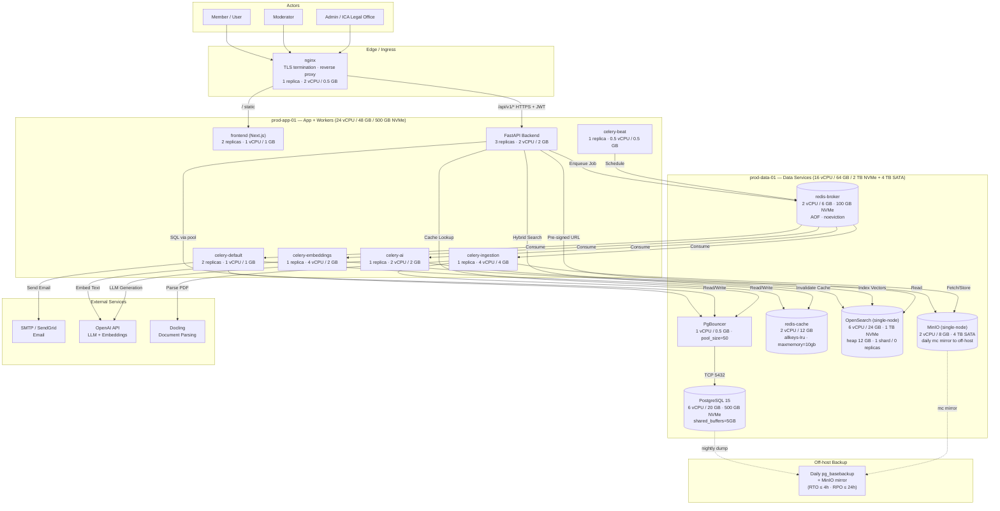
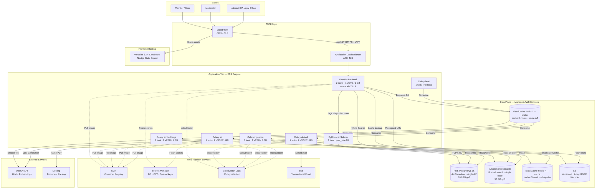

# ICA Restricted Legal Platform — Deployment Instructions

> Source of truth for deploying the platform in any of the four supported configurations. Aligns with `Docs/Solution-Architecture-Document.md` §10 and §13.

---

## 1. Deployment Options

| Option | Scope | Phase 1 (MVP) | Phase 2 (AI + i18n) | Compose file |
|---|---|:---:|:---:|---|
| 1-DEV | MVP only | ✓ | — | `docker-compose.option1-devqa.yml` |
| 1-PROD | MVP only | ✓ | — | `docker-compose.option1-prod.yml` |
| 2-DEV | Full scope | ✓ | ✓ | `docker-compose.option2-devqa.yml` |
| 2-PROD | Full scope (single-host or beefy node) | ✓ | ✓ | `docker-compose.option2-prod.yml` |
| 2-PROD-A | Full scope, **Profile A 2-node split** (Swarm) | ✓ | ✓ | `docker-compose.option2-prod-profileA.yml` |

**Phase 1 scope:** Auth, User & Org management, Document repository + Docling ingestion, Q&A, News, Social feed, Hybrid search (BM25 + k-NN), Moderation queue, Admin dashboard, Taxonomy.

**Phase 2 additions:** LangGraph RAG assistant (`/ai/ask`), AI content pre-screen, AI summarisation, AI answer suggestions, related-content k-NN, Q&A discussion comments, Q&A → knowledge article promotion, news pinning, GDPR data export, AI cost dashboard, multi-language UI + content (EN/ES/FR) with translation cache.

---

## 2. Hardware Requirements

### Dev / QA (single host or 2-node)

| Option | vCPU | RAM | Storage |
|---|---:|---:|---|
| **1-DEV** | 12 | 32 GB | 1 TB NVMe SSD |
| **2-DEV** | 16 | 48 GB | 1.5 TB NVMe SSD |

### Production (compact single-host)

| Option | vCPU | RAM | Storage |
|---|---:|---:|---|
| **1-PROD** | 24 | 64 GB | 2 TB NVMe + external object storage |
| **2-PROD** | 32 | 96 GB | 3 TB NVMe + 8 TB object storage |

### Production (Profile A — 2-node split, Swarm)

| Node | vCPU | RAM | Storage | Role |
|---|---:|---:|---|---|
| **prod-app-01** (`tier=app`) | 24 | 48 GB | 500 GB NVMe | FastAPI + Celery + frontend + nginx |
| **prod-data-01** (`tier=data`) | 16 | 64 GB | 2 TB NVMe + 4 TB SATA SSD | Postgres + PgBouncer + Redis + OpenSearch + MinIO |
| **TOTAL** | **40** | **112 GB** | **2.5 TB NVMe + 4 TB SATA** | |

Target capacity: ~2,000 registered users, ~500 DAU, ~50 concurrent peak. RTO ≤ 4 h, RPO ≤ 24 h. Full per-service breakdown in §15.1.

> For full HA (3-node OpenSearch quorum, Postgres replica, Redis Sentinel, distributed MinIO), see Solution Architecture Document §10.4 — that topology requires migrating off single-host Compose onto Docker Swarm or K3s with the per-tier node sizing documented there.

---

## 3. Prerequisites

### Host OS (all options)
- **Linux** (Ubuntu 22.04 LTS, Debian 12, or RHEL 9 recommended)
- Kernel ≥ 5.10 with cgroup v2
- `vm.max_map_count=262144` (required by OpenSearch):
  ```bash
  echo "vm.max_map_count=262144" | sudo tee -a /etc/sysctl.conf
  sudo sysctl -p
  ```

### Required software
| Software | Version | Notes |
|---|---|---|
| Docker Engine | ≥ 24.0 | `docker --version` |
| Docker Compose plugin | ≥ 2.20 | `docker compose version` |
| Git | ≥ 2.30 | For cloning the repo |
| openssl | any | For generating JWT secret |

Install on Ubuntu/Debian:
```bash
curl -fsSL https://get.docker.com | sh
sudo usermod -aG docker $USER
newgrp docker
```

### Outbound network access required
- Docker Hub / your container registry (for image pulls)
- OpenAI API (`api.openai.com:443`) — **Phase 2 only**
- SMTP relay or SendGrid (port 587/443) — for email
- NTP (port 123) — host clock sync mandatory (JWT validation)

---

## 4. One-Time Host Preparation (production only)

```bash
# Data directories with proper ownership
sudo mkdir -p /srv/ica/{postgres,pg-wal,redis-broker,opensearch,minio,tls}
sudo chown -R 999:999 /srv/ica/postgres /srv/ica/pg-wal      # postgres uid
sudo chown -R 1000:1000 /srv/ica/opensearch                  # opensearch uid
sudo chown -R 999:1000 /srv/ica/redis-broker                 # redis uid
sudo chmod 700 /srv/ica/postgres

# TLS certificates (use Let's Encrypt or your CA)
sudo cp fullchain.pem /srv/ica/tls/cert.pem
sudo cp privkey.pem   /srv/ica/tls/key.pem
sudo chmod 600 /srv/ica/tls/*.pem
```

---

## 5. Repository Setup

```bash
git clone <repo-url> ica-platform
cd ica-platform
```

The Compose files are at the repository root:
```
docker-compose.option1-devqa.yml
docker-compose.option1-prod.yml
docker-compose.option2-devqa.yml
docker-compose.option2-prod.yml             # single beefy host (≥ 32 vCPU / 96 GB)
docker-compose.option2-prod-profileA.yml    # 2-node Swarm split (Profile A — §15.1)
```

---

## 6. Environment Configuration

### 6.1 Dev / QA — `.env` (auto-loaded by Compose, optional)

The dev Compose files have working defaults. For Option 2, you should set the OpenAI key:

```bash
# .env (at project root)
OPENAI_API_KEY=sk-your-key-here
```

### 6.2 Production — `.env.prod` (mandatory)

Create `.env.prod` at the project root. **Never commit this file.**

```bash
# === Postgres ===
PG_USER=ica
PG_PASSWORD=<generate: openssl rand -base64 32>
PG_DB=ica
DATABASE_URL=postgresql+asyncpg://ica:<PG_PASSWORD>@pgbouncer:5432/ica
ANALYTICS_DATABASE_URL=postgresql+asyncpg://ica:<PG_PASSWORD>@postgres-replica:5432/ica  # or same as DATABASE_URL if no replica

# === Object storage (external S3 or self-hosted MinIO) ===
S3_ENDPOINT_URL=https://s3.your-region.amazonaws.com    # or http://minio:9000
S3_BUCKET=ica-prod-documents
S3_ACCESS_KEY=<key>
S3_SECRET_KEY=<secret>

# === OpenSearch ===
OPENSEARCH_ADMIN_USER=admin
OPENSEARCH_ADMIN_PASSWORD=<generate: openssl rand -base64 24>

# === Auth ===
JWT_SECRET=<generate: openssl rand -base64 48>
FRONTEND_URL=https://app.ica.example.com
PUBLIC_API_URL=https://api.ica.example.com

# === Container image source ===
ECR_REGISTRY=<your-registry-host>
IMAGE_TAG=<git commit SHA — never "latest">

# === Email ===
EMAIL_PRIMARY_PROVIDER=sendgrid
EMAIL_FALLBACK_PROVIDER=smtp
SENDGRID_API_KEY=<key>
SMTP_HOST=smtp.example.com
SMTP_PORT=587
SMTP_USER=<user>
SMTP_PASSWORD=<password>

# === Phase 2 only (Option 2-PROD) ===
OPENAI_API_KEY=sk-<your-production-key>
OPENAI_LLM_MODEL=gpt-4o-mini
TRANSLATION_PROVIDER=openai
```

**Permission:** `chmod 600 .env.prod`

---

## 7. Build Container Images

### Option A — Build locally (dev/QA, or when you don't use a registry)
```bash
docker compose -f docker-compose.option2-devqa.yml build
```

### Option B — Pull from registry (production)
```bash
# Authenticate to your registry first (example for AWS ECR)
aws ecr get-login-password --region us-east-1 | \
  docker login --username AWS --password-stdin $ECR_REGISTRY

# Pull
docker compose -f docker-compose.option2-prod.yml --env-file .env.prod pull
```

Production images **must** be tagged with the Git commit SHA — never `latest` (per SAD §10.5).

---

## 8. Deployment Procedure

### 8.1 Dev / QA (Option 1 or Option 2)

```bash
# Replace <option> with option1 or option2
docker compose -f docker-compose.<option>-devqa.yml up -d
```

Verify all containers are healthy:
```bash
docker compose -f docker-compose.<option>-devqa.yml ps
```

Expected services running:

| Option 1-DEV | Option 2-DEV (adds) |
|---|---|
| postgres, pgbouncer, redis-broker, redis-cache, opensearch, minio, backend, celery-default, celery-ingestion, celery-embeddings, celery-beat, frontend | + **celery-ai** |

### 8.2 Production (Option 1 or Option 2)

**Step 1 — Pre-deploy: run database migrations** (blocking; SAD NG-8 expand-contract pattern)
```bash
docker compose -f docker-compose.<option>-prod.yml --env-file .env.prod \
  run --rm backend alembic upgrade head
```
If this fails, **do not proceed.** Investigate, fix, re-run. Old containers (if any) keep serving traffic.

**Step 2 — Start data plane first**
```bash
docker compose -f docker-compose.<option>-prod.yml --env-file .env.prod \
  up -d postgres pgbouncer redis-broker redis-cache opensearch
```
Wait ~30s for OpenSearch to be green:
```bash
curl -u admin:$OPENSEARCH_ADMIN_PASSWORD http://localhost:9200/_cluster/health
```

**Step 3 — Start application tier**
```bash
docker compose -f docker-compose.<option>-prod.yml --env-file .env.prod up -d
```

**Step 4 — Verify**
```bash
# All services healthy
docker compose -f docker-compose.<option>-prod.yml ps

# Backend readiness probe (checks PG, Redis, OpenSearch)
curl https://api.ica.example.com/health/ready
# Expected: {"status":"ok","db":"ok","redis_broker":"ok","redis_cache":"ok","opensearch":"ok"}
```

### 8.3 Production — Profile A (2-node Swarm split)

Profile A pins data services to `prod-data-01` and app/worker services to `prod-app-01` via Docker Swarm placement constraints. `docker compose up` **ignores** `placement.constraints` — you must use `docker stack deploy`.

**Step 1 — Initialise the Swarm (one-time)**
```bash
# On prod-app-01 (becomes the Swarm manager)
docker swarm init --advertise-addr <prod-app-01-ip>
# Copy the printed `docker swarm join --token ...` command.

# On prod-data-01
docker swarm join --token <token> <prod-app-01-ip>:2377

# Back on prod-app-01: label the nodes (constraints key off these)
docker node update --label-add tier=app  prod-app-01
docker node update --label-add tier=data prod-data-01
docker node ls   # verify both nodes Ready, labels visible via `docker node inspect`
```

**Step 2 — Load `.env.prod` into the manager's environment**

`docker stack deploy` does **not** read `--env-file`. Either export the vars in the shell or use Swarm secrets:
```bash
set -a; source .env.prod; set +a
```

**Step 3 — Pre-deploy: migrations** (run as a one-off service on the manager)
```bash
docker run --rm \
  --env-file .env.prod \
  ${ECR_REGISTRY}/ica-backend:${IMAGE_TAG} \
  alembic upgrade head
```
If this fails, **do not proceed.** Investigate, fix, re-run.

**Step 4 — Deploy the stack**
```bash
docker stack deploy \
  -c docker-compose.option2-prod-profileA.yml \
  --with-registry-auth \
  ica
```

If you are self-hosting object storage on the data node, include the optional MinIO service:
```bash
# Profile is honored at compose-config time; render the file with MinIO enabled:
docker compose -f docker-compose.option2-prod-profileA.yml --profile with-minio config \
  | docker stack deploy -c - --with-registry-auth ica
```

**Step 5 — Verify placement and health**
```bash
docker stack services ica
docker stack ps ica --no-trunc           # confirm each task landed on the expected node
curl https://api.ica.example.com/health/ready
```

**Single-node fallback:** if running Profile A on one beefy host (≥ 40 vCPU / 112 GB / 2.5 TB NVMe) instead of the 2-node split, you can skip Swarm — strip the `<<: *place-data` / `<<: *place-app` lines from the file and use `docker compose -f docker-compose.option2-prod-profileA.yml --env-file .env.prod up -d`.

> Swarm limitation: `depends_on.condition: service_healthy` is ignored under `docker stack deploy`. Startup ordering is best-effort; the backend's readiness probe + `restart-on-failure` handle eventual convergence.

---

## 9. Post-Deployment Setup

### 9.1 Seed OpenSearch index templates
```bash
docker compose -f docker-compose.<option>-<env>.yml \
  exec backend python -m app.scripts.bootstrap_opensearch
```

This creates the index templates: `ica_documents`, `ica_document_chunks`, `ica_questions`, `ica_news`, `ica_posts` (+ `ica_knowledge_articles` for Option 2).

### 9.2 Create the initial Admin user
```bash
docker compose -f docker-compose.<option>-<env>.yml \
  exec backend python -m app.scripts.create_admin \
    --email admin@ica.example.com \
    --first-name "ICA" --last-name "Admin"
```
The script prints an invite link. Open it to set the password.

### 9.3 Load taxonomy seed data
```bash
docker compose -f docker-compose.<option>-<env>.yml \
  exec backend python -m app.scripts.seed_taxonomy
```
Seeds countries (ISO-3166), default categories, and tag dictionary.

### 9.4 (Option 2 only) Warm AI usage tables
```bash
docker compose -f docker-compose.option2-<env>.yml \
  exec backend python -m app.scripts.bootstrap_ai_usage
```

---

## 10. Verification Checklist

After deployment, verify each path:

| Check | Command / URL |
|---|---|
| Liveness | `GET /health/live` → 200 |
| Readiness | `GET /health/ready` → 200 with all deps `ok` |
| OpenAPI | `GET /docs` (dev) loads Swagger UI |
| Login (admin) | Sign in via frontend → JWT issued |
| Document upload | Upload a PDF → moderation queue shows it pending |
| Approve doc | Approve in moderator UI → Docling ingestion job runs (check `celery-ingestion` logs) |
| Search | Approved doc appears in `/search?q=...` within ~10s |
| Q&A | Submit a question → expert receives email/notification |
| News broadcast | Publish news → all users get notification |
| **Phase 2** AI ask | `/ai/ask` returns a cited answer (or "pending expert review" if low confidence) |
| **Phase 2** Translation | `?lang=es` returns translated content (cached after first request) |
| **Phase 2** GDPR export | `GET /users/me/export` returns S3 pre-signed URL |
| **Phase 2** AI cost dashboard | Admin sees usage in `/admin/ai-usage` |

---

## 11. Day-2 Operations

### 11.1 Backups (production)
Postgres logical backup (run from a cron job on the host):
```bash
docker compose -f docker-compose.<option>-prod.yml exec -T postgres \
  pg_dump -U $PG_USER -d $PG_DB -F c -f /var/lib/postgresql/data/backup-$(date +%F).dump
```
Copy to off-host storage. Retain ≥ 30 days.

OpenSearch snapshot:
```bash
curl -u admin:$OPENSEARCH_ADMIN_PASSWORD -X PUT \
  "http://localhost:9200/_snapshot/ica/snap-$(date +%F)?wait_for_completion=true"
```
Configure the `ica` snapshot repository to point at S3 or a mounted NFS volume.

MinIO bucket replication or `mc mirror` to off-host target nightly.

### 11.2 Log access
```bash
docker compose -f docker-compose.<option>-<env>.yml logs -f backend
docker compose -f docker-compose.<option>-<env>.yml logs -f celery-ai      # Phase 2
```
For production, ship container stdout to Loki / CloudWatch / ELK via the `awslogs` or `loki` Docker log driver.

### 11.3 Scaling workers manually
```bash
# Scale Celery embeddings worker to 4 instances
docker compose -f docker-compose.<option>-prod.yml \
  up -d --scale celery-embeddings=4 celery-embeddings
```
For automatic queue-depth scaling (KEDA), migrate to K3s — see SAD §10.4.

### 11.4 Rolling update (production)
```bash
# 1. Pull new image
IMAGE_TAG=<new-sha> docker compose -f docker-compose.<option>-prod.yml --env-file .env.prod pull

# 2. Run migrations (expand step only — must be backwards-compatible)
docker compose -f docker-compose.<option>-prod.yml --env-file .env.prod \
  run --rm backend alembic upgrade head

# 3. Recreate containers with new image
IMAGE_TAG=<new-sha> docker compose -f docker-compose.<option>-prod.yml --env-file .env.prod \
  up -d --no-deps backend celery-default celery-ingestion celery-embeddings celery-ai frontend
```
Containers respect `stop_grace_period: 180s` so Celery finishes in-flight tasks before stopping.

### 11.5 Cache warmup (post-deploy)
A `cache_warmup_job` runs automatically 5 minutes after each deployment marker (SAD §10.5). Search latency SLA is suspended during this window — do not raise alerts.

---

## 12. Stopping / Tearing Down

```bash
# Stop containers, preserve data
docker compose -f docker-compose.<option>-<env>.yml down

# Stop + delete volumes (DEV ONLY — destroys all data)
docker compose -f docker-compose.<option>-devqa.yml down -v
```

For production, **never** use `-v` unless decommissioning the entire deployment.

---

## 13. Troubleshooting

| Symptom | Likely cause | Fix |
|---|---|---|
| `backend` health check fails | PgBouncer or Redis not reachable | `docker compose ps` — start missing service; check `DATABASE_URL` env |
| OpenSearch container exits | `vm.max_map_count` too low | `sudo sysctl -w vm.max_map_count=262144` |
| Docling/ingestion tasks time out | `CELERY_TASK_TIME_LIMIT` too short | Already set to 300 s in compose — verify worker memory ≥ 2 GB |
| Embedding tasks redelivered | `visibility_timeout` < task duration | Confirm `CELERY_BROKER_TRANSPORT_OPTIONS={"visibility_timeout":3600}` |
| `/ai/ask` returns 503 | OpenAI key missing or invalid (Option 2) | Check `OPENAI_API_KEY` in `.env.prod`; verify outbound to `api.openai.com` |
| Translation cache empty after deploy | Expected — populated on demand | Pre-warm by triggering `cache_warmup_job` |
| `redis-broker` ran out of memory | Result backend leak | Confirm `CELERY_TASK_IGNORE_RESULT=True`; verify `CELERY_RESULT_BACKEND` unset |
| Celery beat schedule missed | Beat container restarted | Redbeat persists schedule in `redis-broker`; gap ≤ 30 s is expected |
| Frontend 404 on locale routes (Option 2) | `next-intl` middleware not active | Verify `NEXT_PUBLIC_SUPPORTED_LOCALES=en,es,fr` env in frontend container |

---

## 14. Migration Path: Dev → QA → Production

| Stage | Compose file | Data | Image source |
|---|---|---|---|
| Developer workstation | `docker-compose.option<N>-devqa.yml` | Throwaway named volumes | Local build |
| QA / staging VM | Same `*-devqa.yml`, on a VM | Named volumes; manual snapshots | Local build or registry |
| Production | `docker-compose.option<N>-prod.yml` | Bind mounts under `/srv/ica/*`; backed up nightly | Registry, immutable SHA tag |

For multi-region or HA production, the next step is Docker Swarm (least disruption) or K3s/RKE2 (recommended; matches SAD §10.4 K8s topology with KEDA-based autoscaling).

---

## 15. Self-Hosted Production Hardware — Sizing Profiles

Two reference sizings for self-hosted (on-prem, private cloud, or bare-metal VMs) deployment of **Option 2 — Full Scope (Phase 1 + Phase 2)**. Pick the profile that matches your launch target; both can run the `docker-compose.option2-prod.yml` workload, though Profile B requires Swarm or K3s to deploy across multiple nodes.

### 15.1 Profile A — Compact & Economical

**Target capacity:** ~2,000 registered users, ~500 daily active, ~50 concurrent peak sessions.
**HA:** none at data layer (single Postgres, single OpenSearch, single Redis pair). RTO ≤ 4 h via restore from backup; RPO ≤ 24 h.
**Topology:** 2 nodes (recommended split) or 1 beefy node (acceptable).
**Compose file:** `docker-compose.option2-prod-profileA.yml` — see §8.3 for the `docker stack deploy` workflow.

#### A.1 Two-node layout

| Node | Role | vCPU | RAM | Local Storage |
|---|---|---:|---:|---|
| **prod-app-01** | All app + worker containers; nginx; frontend | **24** | **48 GB** | 500 GB NVMe SSD |
| **prod-data-01** | Postgres + PgBouncer + Redis-broker + Redis-cache + OpenSearch + MinIO | **16** | **64 GB** | 2 TB NVMe + 4 TB SATA SSD |

#### A.2 Per-service resource allocation (data node)

| Service | CPU limit | RAM limit | Storage | Config |
|---|---:|---:|---|---|
| Postgres 15 | 6 | 20 GB | 500 GB NVMe | `shared_buffers=5GB`, `effective_cache_size=15GB`, `max_connections=200` |
| PgBouncer | 1 | 0.5 GB | — | pool_size=50, transaction mode |
| redis-broker | 2 | 6 GB | 100 GB NVMe (AOF) | `noeviction`, AOF every 1 s |
| redis-cache | 2 | 12 GB | — | `allkeys-lru`, `maxmemory=10gb` |
| OpenSearch (single-node) | 6 | 24 GB | 1 TB NVMe | Heap `-Xms12g -Xmx12g`, 1 primary shard, 0 replicas |
| MinIO (single-node) | 2 | 8 GB | 4 TB SATA | Daily `mc mirror` to off-host backup |

#### A.3 Per-service resource allocation (app node)

| Service | Replicas | CPU/replica | RAM/replica |
|---|---:|---:|---:|
| FastAPI | 3 | 2 | 2 GB |
| celery-default | 2 | 1 | 1 GB |
| celery-ingestion | 1 | 4 | 4 GB |
| celery-embeddings | 1 | 4 | 2 GB |
| celery-ai | 1 | 2 | 2 GB |
| celery-beat | 1 | 0.5 | 0.5 GB |
| frontend | 2 | 1 | 1 GB |
| nginx | 1 | 2 | 0.5 GB |

#### A.4 Profile A totals

| Metric | Value |
|---|---|
| Nodes | 2 |
| vCPU (total) | **40** |
| RAM (total) | **112 GB** |
| NVMe SSD | **2.5 TB** |
| SATA SSD (object) | **4 TB** |
| Estimated capex | ~$10–15 K |
| Annual opex (power + colo) | ~$3–5 K |

#### A.5 Limitations of Profile A
- Single point of failure at every data tier (drive failure on data node = full outage)
- No Postgres read replica; analytics and read traffic hit the primary
- OpenSearch single-node — cluster restart causes ~30 s search outage
- MinIO single-node — drive loss requires external backup restore
- No autoscaling — peak load throttled by static replica counts
- Maintenance windows required for OS patching, Postgres minor upgrades

**Use when:** soft launch, < 2K users, single timezone, ≤ 4 h RTO acceptable.

#### A.6 Architecture Diagram — Self-hosted Profile A System Context

The diagram below shows how the two physical nodes (`prod-app-01` and `prod-data-01`) are wired together via the Docker Swarm overlay network, and how external services and the off-host backup fit into the topology. It mirrors the system context model from SAD §4.1, with each logical component placed on its physical node.



**Key flow notes:**
- **Node split:** `nginx`, the frontend, FastAPI, and all Celery workers are pinned to `prod-app-01` via Swarm placement constraints (§8.3). All stateful services (Postgres, Redis pair, OpenSearch, MinIO) are pinned to `prod-data-01`.
- **Single Redis broker, two roles:** `redis-broker` only carries Celery queues (AOF on, `noeviction`); `redis-cache` is the search/translation cache (`allkeys-lru`). They are separate container instances — never share DB slots.
- **Database access:** All FastAPI and worker SQL traffic flows through PgBouncer; nothing connects directly to Postgres.
- **External egress:** OpenAI, Docling, and SMTP/SendGrid are only called from Celery workers, never from request-path FastAPI.
- **Backup posture:** Off-host backup is the only recovery mechanism — drive failure on `prod-data-01` triggers full restore (RTO ≤ 4 h, RPO ≤ 24 h per A.5).

---

### 15.2 Profile B — Full HA for 50,000 Users

**Target capacity:** 50,000 registered users, ~12,000 DAU, ~1,500 concurrent peak sessions, ~500 API req/s peak, ~5,000 AI queries/day.
**HA:** N+1 fault tolerance at every tier. RTO ≤ 60 s on automated failover; RPO = 0 (Postgres sync replica).
**Topology:** 19 nodes across compute / data / object-storage / edge / management tiers.
**Orchestration:** **Docker Swarm** (minimum) or **K3s/RKE2** (recommended — enables KEDA queue-depth autoscaling per SAD §10.4).

#### B.1 Load assumptions

| Metric | Estimate |
|---|---|
| Registered users | 50,000 |
| Daily active users | ~12,000 (24 %) |
| Concurrent sessions peak | ~1,500 |
| Peak API req/s | ~500 |
| Documents uploaded / day | ~500 |
| Q&A submitted / day | ~1,000 |
| News broadcasts / week | ~20 (50K notifications each) |
| AI `/ai/ask` requests / day | ~5,000 |
| Document corpus | ~500K PDFs (~5M chunks) |

#### B.2 Application / Worker tier — 3 nodes

| Node | vCPU | RAM | Storage | Role |
|---|---:|---:|---|---|
| **prod-app-01** | **32** | **64 GB** | 500 GB NVMe | FastAPI + celery-default + celery-ai + beat + nginx + frontend |
| **prod-app-02** | **32** | **64 GB** | 500 GB NVMe | FastAPI + celery-default + celery-ingestion |
| **prod-app-03** | **32** | **64 GB** | 500 GB NVMe | FastAPI + celery-embeddings (isolated) + frontend |

Service placement with KEDA max-scale (peak ~87 vCPU, ~70 GB across 3 nodes — ~30 % headroom for spikes):

| Workload | Min/Max replicas | CPU/replica | RAM/replica |
|---|---|---:|---:|
| FastAPI | 2 / 10 | 2 | 2 GB |
| Frontend | 2 / 4 | 1 | 1 GB |
| nginx | 2 / 2 | 2 | 0.5 GB |
| celery-default | 2 / 8 | 1 | 1 GB |
| celery-ingestion | 1 / 4 | 4 | 4 GB |
| celery-embeddings | 2 / 6 | 4 | 2 GB |
| celery-ai | 1 / 4 | 2 | 2 GB |
| celery-beat | 1 / 1 | 0.5 | 0.5 GB |
| PgBouncer | 2 / 2 | 1 | 0.5 GB |

#### B.3 PostgreSQL — 2 nodes (primary + sync replica)

| Node | vCPU | RAM | Storage | Config |
|---|---:|---:|---|---|
| **prod-pg-01** (primary) | **16** | **64 GB** | 2 TB NVMe (PGDATA) + 500 GB NVMe (WAL on separate volume) | `shared_buffers=16GB`, `effective_cache_size=48GB`, `max_connections=400`, `synchronous_commit=on` |
| **prod-pg-02** (sync replica) | **16** | **64 GB** | 2 TB NVMe + 500 GB NVMe (WAL) | Streaming replica; `ANALYTICS_DATABASE_URL` points here |

**Why sync replica:** RPO = 0 for primary failure. The lag-fallback pattern (SAD §5.9) still applies for read-side latency spikes.

#### B.4 OpenSearch — 3-node cluster

| Node | vCPU | RAM | Storage | Config |
|---|---:|---:|---|---|
| **prod-os-01/02/03** | **8 each** | **32 GB each** | 2 TB NVMe SSD each | Heap `-Xms16g -Xmx16g`, `m=16`, `ef_construction=512`, `ef_search=128`, 3 primary shards per index, 1 replica shard |

All 3 nodes are master+data+ingest. For > 50 M chunks, split out dedicated master nodes.

#### B.5 Redis — 4 nodes (two Sentinel-managed pairs)

| Pair | Node | vCPU | RAM | Storage | Role |
|---|---|---:|---:|---|---|
| **redis-broker** | prod-redis-broker-01 (primary) | 4 | 8 GB | 100 GB NVMe (AOF) | Celery broker only |
| | prod-redis-broker-02 (replica) | 4 | 8 GB | 100 GB NVMe | Async replica + Sentinel quorum |
| **redis-cache** | prod-redis-cache-01 (primary) | 4 | 32 GB | 50 GB NVMe | Search + translation cache; `maxmemory=28gb`, `allkeys-lru` |
| | prod-redis-cache-02 (replica) | 4 | 32 GB | 50 GB NVMe | Async replica + Sentinel quorum |

Sentinel runs co-resident; 3rd sentinel on prod-mgmt-01 for tie-break. Application uses `redis-sentinel://` connection strings. Automatic failover < 30 s.

#### B.6 Object Storage — MinIO distributed (4 nodes)

| Node | vCPU | RAM | Storage | Role |
|---|---:|---:|---|---|
| **prod-minio-01..04** | **4 each** | **16 GB each** | 4 × 8 TB SATA SSD per node (32 TB raw/node = 128 TB raw total) | Distributed mode, EC:4 parity → **~64 TB usable** |

Capacity headroom: ~13 TB working total at year-2; ~5-year runway.

#### B.7 Edge / Load Balancing — 2 nodes (HA pair)

| Node | vCPU | RAM | Storage | Role |
|---|---:|---:|---|---|
| **prod-lb-01/02** | **4 each** | **8 GB each** | 100 GB SSD | HAProxy / Nginx + keepalived (VRRP); floating VIP; TLS termination |

#### B.8 Management / Observability — 1 node

| Node | vCPU | RAM | Storage | Role |
|---|---:|---:|---|---|
| **prod-mgmt-01** | **8** | **32 GB** | 1 TB NVMe + 4 TB SATA | Prometheus + Grafana + Loki + Alertmanager; Sentry (optional); Redis Sentinel tiebreaker; bastion SSH; backup runner |

#### B.9 Profile B totals

| Tier | Nodes | vCPU | RAM | Storage |
|---|---:|---:|---:|---:|
| App / worker | 3 | 96 | 192 GB | 1.5 TB NVMe |
| PostgreSQL | 2 | 32 | 128 GB | 5 TB NVMe |
| OpenSearch | 3 | 24 | 96 GB | 6 TB NVMe |
| Redis (2 pairs) | 4 | 16 | 80 GB | 300 GB NVMe |
| MinIO (distributed) | 4 | 16 | 64 GB | 128 TB SATA SSD |
| Load balancers | 2 | 8 | 16 GB | 200 GB SSD |
| Management | 1 | 8 | 32 GB | 1 TB NVMe + 4 TB SATA |
| **TOTAL** | **19** | **200 vCPU** | **608 GB** | **~14 TB NVMe + ~132 TB SATA** |

#### B.10 Network requirements

| Link | Requirement |
|---|---|
| Inter-node (data plane) | **10 GbE** mandatory |
| North-south (internet egress) | **1 Gbps** minimum, 10 Gbps recommended |
| Switch fabric | 2× ToR switches (HA pair) with MLAG |
| External IPs | Floating VIP for LB pair; one each for management + bastion |

#### B.11 Annual cost estimate (illustrative)

| Item | Estimate |
|---|---|
| Hardware capex (19 mid-range 2U servers) | ~$200–300 K |
| Colo (½ rack, 6 kW, redundant power) | ~$25–40 K/yr |
| Bandwidth (10 Gbps committed) | ~$15–25 K/yr |
| OpenAI API (5K queries/day @ gpt-4o-mini) | ~$15 K/yr |
| Backup target (NAS, off-site) | ~$5–10 K/yr |
| **Year 1 total** | **~$260–390 K** |
| **Recurring (Years 2+)** | **~$60–90 K/yr** |

### 15.3 Side-by-side comparison

| Dimension | Profile A — Compact | Profile B — 50K HA |
|---|---|---|
| Nodes | 2 | 19 |
| vCPU total | 40 | 200 |
| RAM total | 112 GB | 608 GB |
| NVMe storage | 2.5 TB | 14 TB |
| Object storage | 4 TB (single) | 128 TB (distributed) |
| Postgres | Single | Primary + sync replica |
| OpenSearch | Single-node | 3-node cluster |
| Redis | 2 single instances | 2 Sentinel pairs |
| MinIO | Single-node | 4-node distributed |
| Orchestrator | Docker Compose | Docker Swarm or K3s |
| Autoscaling | Manual (`--scale`) | KEDA on queue depth |
| RTO | ≤ 4 h | ≤ 60 s |
| RPO | ≤ 24 h | 0 (sync replica) |
| Suitable user count | ≤ 2,000 | up to 50,000 |
| Year-1 cost | ~$15–20 K | ~$260–390 K |
| Recurring opex | ~$5–8 K/yr | ~$60–90 K/yr |

### 15.4 Migration path from Profile A to Profile B

| Phase | Action |
|---|---|
| 1. Snapshot | Take `pg_basebackup`, OpenSearch snapshot, `mc mirror` MinIO to off-site |
| 2. Stand up new data plane | Provision the 2× PG, 3× OpenSearch, 4× Redis, 4× MinIO nodes in parallel; restore from snapshots |
| 3. Replicate live | Run async streaming replication from Profile A PG to new primary; `mc mirror --watch` MinIO live |
| 4. Switch app tier | Move `docker-compose.option2-prod.yml` workload onto K3s as Deployments + KEDA ScaledObjects; cut DNS over |
| 5. Decommission | Verify 1 week stable; decommission Profile A nodes |

Container definitions are identical — the SAD's "K8s-ready without refactoring" principle applies (per SAD §10.4).

---

## 16. AWS Deployment

If self-hosting is not preferred, the same application stack deploys to AWS managed services with minimal config change. Two equivalent profiles mirror the self-hosted ones.

### 16.1 Why AWS over self-hosted?

| Self-hosted | AWS managed |
|---|---|
| Capex-heavy, lower opex | Pure opex |
| You operate Postgres, OpenSearch, Redis | RDS, OpenSearch Service, ElastiCache (managed) |
| You own DR and patching | AWS-managed backups, AZ failover, patching |
| Predictable cost | Variable (autoscaling) |
| Full data residency control | Region-bound; check legal/compliance constraints |
| Best for: stable load, regulatory mandate, existing DC | Best for: variable load, faster time-to-market, smaller ops team |

### 16.2 Profile A-AWS — Compact (~2,000 users)

| Component | AWS Service | Spec |
|---|---|---|
| Container compute | **ECS Fargate** | FastAPI: 2 tasks × 1 vCPU / 2 GB; service autoscaling 2 → 4 on CPU 70 % |
| Load balancer | **Application Load Balancer (ALB)** | 1 ALB; TLS via ACM |
| CDN | **CloudFront** | In front of ALB; cache reference-data endpoints |
| PostgreSQL | **RDS PostgreSQL 15** | `db.t3.medium` (2 vCPU / 4 GB), Multi-AZ disabled (single AZ), 100 GB gp3 SSD, automated daily backups (7-day retention) |
| PgBouncer | ECS Fargate sidecar | 1 task, 0.5 vCPU / 0.5 GB, pool_size=20 |
| Redis broker | **ElastiCache Redis 7** | `cache.t3.micro` (0.5 vCPU / 0.5 GB), single-AZ |
| Redis cache | **ElastiCache Redis 7** | `cache.t3.small` (2 vCPU / 1.5 GB), single-AZ, `allkeys-lru` |
| OpenSearch | **Amazon OpenSearch Service** | 1 × `t3.small.search` (2 vCPU / 2 GB), 50 GB gp3 — single-node dev tier |
| Celery workers | **ECS Fargate** | `default` 1 task (1 vCPU/1 GB) · `ingestion` 1 task (2/2) · `embeddings` 1 task (2/1) · `ai` 1 task (1/1) · `beat` 1 task (0.25/0.5) |
| Object storage | **S3** | Standard tier, versioning enabled, 7-day lifecycle on GDPR exports |
| Email | **SES** | Sandbox first, then production access |
| Secrets | **Secrets Manager** | Postgres password, JWT secret, OpenAI key |
| Container registry | **ECR** | Backend and frontend images |
| Logs | **CloudWatch Logs** | 30-day retention |
| Frontend | **Vercel** or **S3 + CloudFront** | Static export |
| **Estimated monthly cost** | | **~$650–900 USD** |

#### 16.2.1 Architecture Diagram — Profile A-AWS System Context

The diagram below illustrates how the AWS services in Profile A-AWS are wired together — request flow, async pipeline, data plane, and external integrations. It mirrors the system context model from SAD §4.1, with each logical component mapped onto its concrete AWS service.



**Key flow notes:**
- **Ingress:** CloudFront terminates client TLS, serves static frontend assets, and proxies `/api/v1/*` to the ALB. ALB terminates TLS again (ACM cert) before forwarding to ECS tasks in private subnets.
- **Database access:** FastAPI tasks always connect through the PgBouncer sidecar — never directly to RDS — to keep PG connection counts bounded under autoscaling.
- **Async pipeline:** All heavy work (OCR, embedding, LLM, email) is enqueued onto `redis-broker` and consumed by the dedicated Celery queues. `celery-beat` is the only scheduled-job producer.
- **Single-AZ trade-off:** Per §15.1, Profile A intentionally runs single-AZ data services (RDS, ElastiCache, OpenSearch) to hit the ~$650–900/mo budget. Upgrading any of these to Multi-AZ is the first step on the migration path to Profile B-AWS (§16.3).
- **External egress:** Only OpenAI and Docling are reached outside AWS; both are called exclusively from Celery workers, never from the request-path FastAPI tasks.

### 16.3 Profile B-AWS — Full HA for 50,000 Users

| Component | AWS Service | Spec |
|---|---|---|
| Container compute | **ECS Fargate** or **EKS** (recommended for KEDA) | FastAPI: 2 → 10 tasks × 2 vCPU / 4 GB |
| Load balancer | **ALB** (HA pair across AZs) | TLS via ACM; sticky sessions disabled |
| CDN | **CloudFront** | Cache `/categories`, `/countries`, `/tags` (TTL 1h); `/news?featured=true` (TTL 5min) |
| WAF | **AWS WAF** | Managed rules + custom rate-limit rules |
| PostgreSQL | **RDS PostgreSQL 15** | `db.m6g.large` (2 vCPU / 8 GB) → `db.m6g.xlarge` (4/16) at peak, **Multi-AZ enabled**, 500 GB gp3 (provisioned IOPS 3000), automated backups 30 days, 1 read replica (`db.m6g.large`) for analytics |
| PgBouncer | ECS / EKS sidecar | 2 tasks, pool_size=50, transaction mode |
| Redis broker | **ElastiCache Redis 7** | `cache.m6g.large` (2 vCPU / 6.4 GB), **Multi-AZ failover enabled** |
| Redis cache | **ElastiCache Redis 7** | `cache.m6g.large` (2 vCPU / 6.4 GB), Multi-AZ, `allkeys-lru` |
| OpenSearch | **Amazon OpenSearch Service** | 3-node cluster, `m6g.large.search` (2 vCPU / 8 GB) each, 500 GB gp3 per node, dedicated 3 × `t3.small.search` master nodes |
| Celery `default` | ECS / EKS + KEDA | min=2, max=8, 1 vCPU / 1 GB each |
| Celery `ingestion` | ECS / EKS + KEDA | min=1, max=4, 4 vCPU / 4 GB each |
| Celery `embeddings` | ECS / EKS + KEDA | min=2, max=6, 4 vCPU / 2 GB each |
| Celery `ai` | ECS / EKS + KEDA | min=0 (scale-to-zero), max=4, 2 vCPU / 2 GB each |
| Celery `beat` | ECS / EKS | 1 task, Redbeat-backed |
| Object storage | **S3** | Versioning, cross-region replication, intelligent-tiering for archive |
| Email | **SES** + SendGrid failover | Per SAD email provider failover |
| Secrets | **Secrets Manager** | All credentials; rotation enabled for RDS |
| KMS | **AWS KMS** | Encryption keys for RDS, S3, Secrets Manager |
| Container registry | **ECR** | Image scanning on push |
| Logs | **CloudWatch Logs** + **OpenSearch** | 90-day retention; query via CloudWatch Insights |
| Metrics | **CloudWatch** + **Managed Prometheus** | Per SAD §12 metric set |
| Tracing | **AWS X-Ray** | Optional |
| Frontend | **CloudFront + S3** or **Vercel** | Static export |
| VPC | Dedicated VPC, 3 AZs, private subnets for compute + data, NAT gateways | |
| **Estimated monthly cost** | | **~$3,500–5,500 USD** (excl. OpenAI API ~$1,500/mo) |

### 16.4 AWS deployment workflow (CI/CD)

Per SAD §10.5:

```
1. Push to main → GitHub Actions
2. Build Docker images (backend + frontend)
3. Push to ECR (tag = $GITHUB_SHA, never "latest")
4. Run Alembic migrations as ECS task (BLOCKING — pre-deploy)
   aws ecs run-task --task-definition ica-migrate --overrides '...'
5. Deploy services (rolling update, blue/green for ALB target group)
   aws ecs update-service --service ica-backend --force-new-deployment
   aws ecs update-service --service ica-celery-default --force-new-deployment
   ...
6. Deploy frontend (S3 sync + CloudFront invalidation, or Vercel deploy)
7. Smoke test /health/ready against ALB DNS
8. Trigger cache_warmup_job 5 minutes post-deploy
9. Slack/Teams notification with commit SHA + deploy duration
```

### 16.5 AWS IaC

Recommend **Terraform** modules organised per SAD tier:

```
infra/
├── networking/        # VPC, subnets, NAT, route tables, ALB
├── compute/           # ECS cluster, services, task definitions, IAM
├── data/              # RDS, ElastiCache, OpenSearch Service
├── storage/           # S3 buckets, KMS keys, lifecycle policies
├── observability/     # CloudWatch dashboards, alarms, log groups
├── security/          # WAF, Security Hub, Secrets Manager
└── envs/
    ├── dev/
    ├── staging/
    └── prod/
```

Alternative: **AWS CDK** (Python) for tighter integration with FastAPI tooling.

### 16.6 AWS environment promotion path

| Environment | AWS account | Compute size | Notes |
|---|---|---|---|
| Dev | Shared dev account | Docker Compose on EC2 `t3.large` OR ECS Fargate at minimum spec | One per developer optional |
| QA / Staging | Staging account | ~30 % of production spec | Same architecture as prod; smaller instances |
| Production | Prod account | Profile A-AWS or B-AWS | Multi-AZ; production secrets only |

Each AWS account is isolated (per AWS Well-Architected); cross-account IAM roles handle CI/CD deploys.

### 16.7 Cost optimisation levers (Profile B-AWS)

| Lever | Savings |
|---|---|
| Reserved Instances or Savings Plans (3-year, all-upfront) | ~40 % on RDS, ElastiCache, OpenSearch |
| Graviton (`m6g`, `r6g`) instances vs Intel | ~20 % on compute |
| Celery `ai` queue scale-to-zero | Eliminates idle LLM-worker cost |
| S3 Intelligent-Tiering for archived documents | ~30 % on object storage |
| CloudFront caching of reference-data endpoints | Reduces ALB + ECS task time |
| Spot capacity for `celery-embeddings` (CPU-bound, restartable) | ~60 % on that tier |
| **Combined savings** | **~30–40 % off list price** |

### 16.8 AWS profile comparison

| Dimension | A-AWS Compact | B-AWS Full HA |
|---|---|---|
| Compute platform | ECS Fargate | ECS Fargate or EKS |
| Multi-AZ | No (single AZ) | Yes (3 AZs) |
| RDS | Single instance | Multi-AZ + read replica |
| OpenSearch | 1 node | 3 data + 3 master |
| Redis | Single AZ | Multi-AZ failover |
| Autoscaling | Application Auto Scaling | Application Auto Scaling + KEDA (EKS) |
| Frontend | S3+CloudFront / Vercel | Same |
| Suitable user count | ≤ 2,000 | up to 50,000+ |
| Monthly cost (est.) | ~$650–900 | ~$3,500–5,500 (+ OpenAI) |
| Time-to-launch | ~1 week | ~3–4 weeks |

### 16.9 When to choose AWS vs self-hosted

| Decision factor | Lean AWS | Lean self-hosted |
|---|---|---|
| Existing data centre & ops team | | ✓ |
| Compliance mandates data residency | | ✓ |
| Variable / spiky load | ✓ | |
| Small ops headcount | ✓ | |
| Capex budget available | | ✓ |
| Opex budget preferred | ✓ | |
| Multi-region rollout planned | ✓ | |
| < 6-month launch target | ✓ | |
| 5-year TCO sensitivity | | ✓ |

---

## 18. CDN Configuration — CloudFront + AWS WAF

Applies to both Profile A-AWS and Profile B-AWS (§16). CloudFront sits in front of the ALB and serves two distinct roles: **static asset delivery** for the Next.js frontend and **API response caching** for a small set of high-read, low-churn endpoints.

### 18.1 Why CloudFront is used for API caching

The backend returns explicit `Cache-Control` headers for endpoints whose responses are:
- **Identical for every authenticated viewer** (no per-user personalisation)
- **High read volume** (hit on every page load or session start)
- **Tolerant of short staleness** (seconds-to-minutes acceptable)

CloudFront cache behaviours match on these headers and absorb the traffic at the edge — requests never reach the ALB, FastAPI, or the database.

### 18.2 Cache behaviour rules

| Path / Query | `Cache-Control` header (from backend) | CloudFront TTL | Rationale |
|---|---|---:|---|
| `/categories`, `/countries`, `/tags` | `public, max-age=3600` | **60 min** | Taxonomy reference data — changes only on admin seed/update; extremely high hit ratio |
| `/news?featured=true` | `public, max-age=300` | **5 min** | Homepage featured-news ribbon — same content for all users within a country scope; high volume but admin can update pinning, so short TTL acceptable |
| All other `/news` variants (paginated, filtered) | `private, no-store` | **0 (bypass)** | Contain `?page=`, `?country=`, `?category=`, `?lang=` permutations; per-user context; caching would shred hit ratio and risk stale moderation state |
| All authenticated personalised endpoints | `private, no-store` | **0 (bypass)** | JWT-scoped responses — never cached at the edge |
| `/health/live`, `/health/ready` | Not cached | **0 (bypass)** | Must hit origin for accurate status |
| `/metrics` | Blocked at edge | **403** | WAF rule blocks public access; internal/VPN only |

### 18.3 Why `/news?featured=true` specifically

`GET /news?featured=true` is the admin-curated featured-news ribbon rendered on the homepage of every session. Three properties make it a good CDN-cache candidate:

1. **Same response for every viewer** — featured pins are global within a country scope; no per-user personalisation in the response body.
2. **Highest read volume of all news endpoints** — every authenticated user loads the homepage on login; at 50 K users this is the single most-hit API path after `/health`.
3. **Mild staleness is acceptable** — a 5-minute delay between an admin pinning a story and members seeing it is within product SLA. This is not a real-time feed.

CloudFront cache behaviours distinguish the cached `?featured=true` variant from all other `GET /news` requests using **query string whitelisting** — only `featured` is part of the cache key; all other query string permutations bypass the cache.

### 18.4 AWS WAF rules

| Rule | Type | Purpose |
|---|---|---|
| OWASP Managed Rules | AWS Managed Rule Group | SQLi, XSS, path traversal, protocol anomalies |
| Known Bad Inputs | AWS Managed Rule Group | Common exploit patterns |
| Body size cap (5 MB) | Custom rule | Blocks oversized payloads before they reach the ALB |
| Geo / IP block | Custom rule | Restrict to allowed countries/IPs if required by legal mandate |
| Rate limit (per IP) | Custom rule | Throttle brute-force login and scraping attempts |
| `/metrics` block | Custom rule | Returns HTTP 403 for all public requests to the Prometheus metrics path |

### 18.5 CloudFront cache invalidation

On each production deployment the CI/CD pipeline issues a targeted invalidation (§16.4 step 6):

```bash
# Invalidate reference-data and featured-news cache on deploy
aws cloudfront create-invalidation \
  --distribution-id $CF_DISTRIBUTION_ID \
  --paths "/api/v1/categories" "/api/v1/countries" "/api/v1/tags" "/api/v1/news?featured=true"
```

Admin-triggered content changes (e.g. pinning/unpinning a featured news article) should also trigger a targeted invalidation via a Celery `default` queue task to avoid a 5-minute stale window.

---

## 19. Celery Worker Queue Architecture

The platform runs **four dedicated Celery queues** plus a beat scheduler. They are deployed as separate ECS services (or K8s Deployments) rather than a single combined worker because each queue has different resource profiles, timeout requirements, and autoscaling thresholds — mixing them would cause slow jobs to starve fast ones and prevent accurate KEDA queue-depth scaling.

All workers share the same Docker image (`ica-backend`); the queue assignment is set at container startup via the `-Q` flag.

### 19.1 Why async workers at all

Platform rules require that **heavy tasks never block the HTTP request cycle**. FastAPI enqueues a job and returns immediately; the worker processes it asynchronously. Affected operations include: OCR/document parsing, vector embedding generation, AI inference, translation, email/notification dispatch, and scheduled maintenance jobs.

### 19.2 Queue-by-queue breakdown

#### `celery-default` — General-purpose short I/O jobs

| Attribute | Value |
|---|---|
| Concurrency | `-c 4` |
| Prefetch multiplier | `4` |
| Time limit | 180 s |
| KEDA trigger (Profile B-AWS / K3s) | queue depth > **50** messages; min 1 / max 8 |

**Jobs it runs:**

| Job | Trigger | Description |
|---|---|---|
| Email / in-app notification dispatch | Q&A answer posted, news broadcast, moderation decision | Sends emails via SES/SendGrid and pushes in-app notifications |
| Outbox event relay | Polling every 10 s (via beat) | Reads `outbox_events` table and publishes domain events in the same PG transaction as state changes |
| Moderation alerts | Content submission | Notifies moderators of pending queue items |
| Cache invalidation | Content approval | Purges stale search-cache entries in `redis-cache` |
| GDPR data export packaging *(Phase 2)* | User export request | Zips user data, uploads to S3, emails pre-signed URL |

**Why separate:** High message volume with fast job duration (sub-second to a few seconds). Needs high concurrency and prefetch. If shared with Docling or embedding jobs, one slow 120 s parse would block dozens of fast notification tasks.

---

#### `celery-ingestion` — Docling OCR / document parsing pipeline

| Attribute | Value |
|---|---|
| Concurrency | `-c 2` |
| Prefetch multiplier | `1` |
| Time limit | 300 s (soft 240 s) |
| KEDA trigger | queue depth > **5** messages; min 1 / max 4 |

**Jobs it runs:**

| Job | Trigger | Description |
|---|---|---|
| `document_ingestion_job` | Document approved by moderator | Docling extracts text, OCR, and table structure from uploaded PDFs; 120 s per document; falls back to raw text on partial failure |
| `chunking_job` | After ingestion completes | Splits extracted text into 512-token chunks with 64-token overlap, ready for embedding |

**Why isolated (SAD GAP-5):** Docling is memory-heavy and CPU-intensive — a single PDF parse can consume 2–4 GB RAM for up to 120 s. Running alongside the default queue would exhaust worker memory and block all notification jobs. `prefetch_multiplier=1` ensures KEDA sees the true queue depth and scales pods only when real documents are waiting. `podAntiAffinity` (Profile B-AWS / K3s) spreads pods across AZ nodes to avoid a single-AZ bottleneck.

---

#### `celery-embeddings` — Vector embedding generation

| Attribute | Value |
|---|---|
| Concurrency | `-c 4` |
| Prefetch multiplier | `1` |
| Time limit | 600 s (soft 540 s) |
| KEDA trigger | queue depth > **20** messages; min 2 / max 6 |

**Jobs it runs:**

| Job | Trigger | Description |
|---|---|---|
| `embedding_generation_job` | After chunking completes | Batch-embeds document chunks using the local `all-MiniLM-L6-v2` model, then bulk-indexes into OpenSearch via the k-NN vector field |
| Related-content re-indexing *(Phase 2)* | Knowledge article promoted | Updates k-NN index for new knowledge articles and featured documents |

**Why separate:** Pure CPU-bound batch work running a local ML model (not an API call). Needs high CPU allocation (4 vCPU limit). Running alongside LLM AI jobs — which block on network I/O to OpenAI — would waste CPU sitting idle waiting for API latency. `prefetch_multiplier=1` ensures accurate KEDA autoscaling during document ingestion bursts (e.g. 500 documents arriving together).

---

#### `celery-ai` — LangGraph RAG / AI inference *(Phase 2)*

| Attribute | Value |
|---|---|
| Concurrency | `-c 2` |
| Prefetch multiplier | `1` |
| Time limit | 300 s (soft 240 s) |
| KEDA trigger | queue depth > **10** messages; min **0** (scale-to-zero) / max 4 |

**Jobs it runs:**

| Job | Trigger | Description |
|---|---|---|
| `ai_answer_generation_job` | `/ai/ask` request | LangGraph RAG pipeline — retrieves top-k chunks from OpenSearch, calls `gpt-4o-mini`, returns cited answer or flags low-confidence responses to the moderation queue |
| `ai_content_flag_job` | UGC submission | AI pre-screen for inappropriate or off-topic content; result stored on submission record and surfaced in moderator queue |
| `ai_summarisation_job` | Knowledge article promotion | Generates summaries for promoted knowledge articles and documents |
| Translation jobs | `?lang=` request (cache miss) | Calls OpenAI translation API, writes result to `redis-cache db=1` (translation cache) |

**Why separate — and why scale-to-zero:** AI jobs are network-I/O-bound (blocking on OpenAI API latency, 2–10 s per call). Completely different cost profile from CPU-bound embedding jobs. **Scale-to-zero** means zero idle ECS task cost when no AI requests are in flight — identified in §16.7 as one of the highest-impact cost saving levers. When a request arrives, KEDA spins up a pod in ~30 s; acceptable for the async answer flow.

---

#### `celery-beat` — Scheduled job clock (Redbeat)

| Attribute | Value |
|---|---|
| Replicas | Always exactly **1** — never scaled up or down |
| Scheduler backend | `redbeat.RedBeatScheduler` (Redis-backed) |

**Schedules it manages:**

| Job | Frequency | Description |
|---|---|---|
| Outbox poller | Every 10 s | Sweeps `outbox_events` for unprocessed rows and enqueues them to `celery-default` |
| Moderation overdue alert | Every hour | Surfaces items pending > 48 h in the moderation queue |
| Cache warmup job | 5 min post-deploy | Pre-warms CloudFront + Redis search cache after each deployment |
| DLQ / result backend cleanup | Nightly | Removes expired Celery task results and dead-letter queue entries |
| AI usage rollup *(Phase 2)* | Every 15 min | Aggregates AI cost events into `ai_usage_events` for the admin dashboard |

**Why Redbeat instead of vanilla beat (SAD GAP-2):** Standard `celery beat` stores the schedule in a local file — container restart causes schedule drift or duplicate executions. `redbeat.RedBeatScheduler` persists the schedule in `redis-broker`, so a pod restart resumes exactly where it left off with at most a ~30 s gap and no duplicate job fires.

### 19.3 Worker comparison summary

| Worker | Bottleneck | Prefetch | KEDA threshold | Scale-to-zero | Phase |
|---|---|---:|---|---|---|
| `celery-default` | Network I/O (email, cache, outbox) | 4 | > 50 msgs | No (min 1) | 1 + 2 |
| `celery-ingestion` | Memory + CPU (Docling, ~120 s/doc) | 1 | > 5 msgs | No (min 1) | 1 |
| `celery-embeddings` | CPU (local ML model) | 1 | > 20 msgs | No (min 2) | 1 |
| `celery-ai` | Network I/O (OpenAI API, 2–10 s) | 1 | > 10 msgs | **Yes (min 0)** | 2 |
| `celery-beat` | N/A — scheduler only | N/A | Fixed = 1 | No (must always run) | 1 + 2 |

### 19.4 Shared reliability settings (all queues)

```yaml
CELERY_TASK_ACKS_LATE: "True"               # Task not acknowledged until complete — prevents message loss on worker crash
CELERY_TASK_REJECT_ON_WORKER_LOST: "True"   # Requeues task if worker dies mid-execution
CELERY_TASK_IGNORE_RESULT: "True"           # Results not stored — keeps redis-broker memory bounded to actual queue depth
CELERY_BROKER_TRANSPORT_OPTIONS: '{"visibility_timeout": 3600}'  # Must exceed longest task duration (embeddings ~600s)
```

`visibility_timeout` (3600 s) must always exceed the longest task's `time-limit`. If it is shorter than a task's runtime, Redis will redeliver the message while the original is still running, causing duplicate execution.

---

## 17. References

- `Docs/Solution-Architecture-Document.md` — §10 Deployment Architecture, §12 Operations, §13 MVP Architecture
- `Docs/implementation-plan.md` — Docker Compose service list, CI/CD pipeline, K8s workload table
- `Docs/PHASE_2_API_TASK_CHECKLIST.md` — Phase 2 backend task list
- `Docs/PHASE_2_UI_TASK_CHECKLIST.md` — Phase 2 frontend task list
- `Docs/requirement-document.md` — Functional requirements and acceptance criteria
- `Docs/API_SPECIFICATION_OPENAPI.md` — §4 Response headers, Cache-Control policy per endpoint
